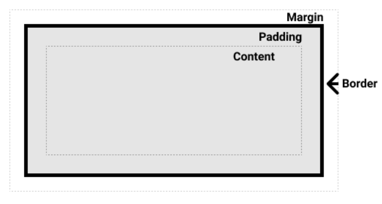

# CSS笔记

层叠样式表，用于设计风格和布局HTML定义的内容结构

## CSS语法
```css
h1 {
    font-size: 20px;
    color: #fff;
}
/* 注释 */
```

主要由两个部分构成： 选择器 { 一条或多条样式声明 }

声明是由`属性名: 属性值`构成，每个声明都要以`；`结尾

注释以`/*开始  结尾*/`

## CSS的引入方式

### 行内样式

在HTML标签添加style属性

```html
<div style="width=100;">
    holle
</div>
```


### 内部样式

通过`<style>`标签定义样式

```html
<style>
    div {
        width: 100px;
    }
</style>
<div>
    halo！
</div>
```


### 外部引入样式

在`.css`文件中编写样式，在`HTML`文件`head`标签中使用<link>标签进行引入

```html
<link rel="stylesheet" href="./index.css">
```


### 导入样式

在css文件中通过`import`引入样式文件


## CSS选择器

选择器是告诉浏览器哪个HTML元素应被选中应用CSS样式


### 选择器的种类

#### 标签选择器

```css
h1 { font-size: 20px; }
```

#### 类选择器

```css
.myStyle {
	font-size: 20px;
}
```

#### ID选择器

```css
#myStyle {
    font-size: 20px;
}
```

#### 标签属性选择器

指定元素上拥有指定属性的元素

```css
a[title] {
	font-size: 20px;
}
```

指定具有特定属性值的元素

```css
a[href="#"] {
    font-size: 20px;
}
```

#### 伪类/伪元素选择器

伪类是当元素处于某种特定状态的时候， 使用`：状态值`标识

```css
a:hover {
    color: red;
}
```

常用伪类：

- :active
- :hover
- :focus
- :link
- :nth-child(n)
- :visited

伪元素是选中的元素的某个部分，例如`::before`在元素内容之前插入一些内容

```css
p::before {
    content: '插入内容';
    font-size: 20px;
}
```

常用伪元素： 

- ::after
- ::before
- first-letter
- first-line
- ::selection


#### 关系选择器（运算符）

##### 后代选择器

用两个选择器之间用`空格`连接， 选中父类中**所有层**下对应的指定选择器

```css
div p {
    font-size: 20px;
}
```


##### 子代选择器

两个选择器之间用`>`连接，选中>前选择器中**一层**子集下指定的选择器

```css
div>p {
    color: red;
}
```


##### 相邻兄弟选择器

两个选择器之间用`+连接，选中+前选择器相邻兄弟的指定选择器

```css
h2+p {
    color: red;
}
```


##### 通用兄弟选择器

两个选择器之间用`~`连接，选中~前选择器之后所有同级的指定选择器

```css
p~span {
    color: red;
}
```

### 权重（优先级）

当一个元素在有多个选择器选中设置样式时候，决定着设置的样式规则是否生效问题，浏览器通过优先级来判断使用样式规则

#### 权重等级

第一等：代表内联样式，如: `style=""`，权值为1000
第二等：代表ID选择器，如：`#box`，权值为100
第三等：代表class，伪类和属性选择器，如 `.box`，权值为10
第四等：代表元素和伪元素选择器，如 `h2`、`:before` 与 `:after`，权值为1

还有`！important`强制手段设置样式， 如：`color: red !important；`，在正常情况下，一般不推荐写。

**用这些权值数字只是为了方便我们理解权重的计算*

#### 权重计算

权重值从0开始计算，遇到一个行内样式 **+1000**, 一个ID **+100**,  一个 class、伪类、属性选择器 **+10**， 一个元素、伪元素选择器 **+1**

例 : 如下代码

```html
<div class="box" id="box1">
    <P>
        <span class="txt">测试显示颜色</span>
    </P>
</div>
```

```css
#box1.box p span.txt {
    color: blue;
}
div#box1.box p span {
    color: red;
}
```


`#box1.box p span.txt`权重值为100 + 10 + 1 + 1 + 10 = 122

`div#box1.box p span`权重 值为1 + 100 + 10 + 1 + 1 = 113

所以采用了`color：blue;`规则


#### CSS样式规则

- 在相同权重情况下， 样式结果为后出现的选择器
- 在不同权重情况下， 权重值高的规则生效
- **通配符**选择器权重为 **0**
- 无论多少个标签选择器都不如class选择器权重高
- 与**元素越接近**的规则生效，比如html文件中嵌入式样式比css文件引入优先，和下面例子

​	例子： 给id为my_ul的`ul`下 `li`设置`color`

```html
<ul id="my_ul">
	<li>我是测试文字</li>
</ul>
```

```css
ul#my_ul {
    color: red;
}
ul li {
    color: blue;
}
```

上文代码中， 虽然ID选择器权重大于标签选择器，但`ul li`比配更贴近`li`元素所以生效为**蓝色**


## 盒模型

在 CSS 中，所有的元素都被一个个的“盒子（box）”包围着，理解这些“盒子”的基本原理，是我们使用 CSS 实现准确布局、处理元素排列的关键。


### 块级盒子、行内盒子、行内块盒子

**块级盒子**是属性`display: block`的元素， 具有以下特征： 

- 默认宽度为父容器宽度
- 每个盒子独占一行
- 可以设置width和height属性
- padding、margin、border会将盒子撑开

**行内盒子**是属性`display:inline`的元素，具有以下特征：

- 不独占一行，多个在可容纳的情况一行连着排列
- width和height属性无效
- 垂直方向padding、margin、border无效
- 水平方向padding、margin、border将盒子撑开

**行内块盒子**是属性`display:inline-block`的元素，具有以下特征：

- 不会独占一行
- 可以设置width，height属性
- padding、margin、border生效撑开盒子


### 盒模型定义

完整的盒模型应用于块级盒子，盒模型的组成：

- content : 内容显示部分
- padding： 内边距，内容包围部分的空白区域
- border： 内容和内边距的边框
- margin： 外边距，盒子边框包围的空白区域




#### 标准盒模型

在标准盒模型中，实际盒子的大小是由定义content的宽高、padding、border组成，设置的width、height属性是content的宽高

```css
.box {
    width: 100px;
    padding: 10px;
    border: 2px;
    margin: 20px;
}
```

上文代码box实际宽度=宽度 + 左（padding、border）+ 右（padding、border)

= (100 + 10 + 10 + 2 +2)px = 124 px

margin不会计入实际的大小


#### 怪异（IE）盒模型

在怪异盒模型中实际大小就是设置width、height值，content部分会根据设置的padding、border值与width、height相减后值

```css
.box {
    width: 200px;
    padding:10px;
    border: 5px;
    margin: 20px;
}
```

上文代码box的实际宽度为200 px，内容部分宽度=width - 左（padding、border) - 右（padding、border)

= 200 - 10 - 5 - 10 - 5 = 170 px

margin不会计入实际的大小


浏览器会默认使用标准盒模型 `content-box`，需要使用怪异盒模型可以通过`box-sizing: border-box`来开启

```css
.box {
	box-sizing: border-box;
}
```


## 布局

### 默认布局（标准文档流）

默认情况下，一个块级元素宽度为父元素的100%，高度为内容高度；内联元素的宽高被内容撑开。

每个块级元素的会在上一个元素下另起一行排列，它们之间通过外边距（margin）进行撑开间隔空间， 自上而下垂直排列。

内联元素的具体大小由内容决定，它们不会另起一行排列，在父级元素宽度可以容纳下的情况下在一行内从左向右排列，在空间不够时，溢出的文本和元素会被移到下一行进行排列。

在相邻两个元素都设置的margin，并当两个margin有重叠时，margin会进行合并，采用较大的margin值作为两个元素相邻的margin距离值。

#### 问题一
块级元素下的行内块级元素会产生多余的底部空间，块级元素高度不等于内容元素的高度

```html
<div class="box">
    <div class="box2"></div>
</div>
```

```css
.box {
    width: 100px;
    background-color: cadetblue;
}
.box2 {
    display: inline-block;
    width: 100px;
    height: 100px;
    background-color: blueviolet;
}
```


解决方案：

- 在父元素设置好指定的高度
- 在父元素设置font-size： 0
- 把inline-block元素设置为block元素


### 弹性布局 （标准文档流） 

弹性盒子是一种用于按行或按列布局元素的一维布局方法。元素可以扩大以填充额外的空间，收缩以适应更小的空间。

弹性布局可以通过给容器设置为**display： flex**来开启，开启flex布局元素下的子元素会被设置为**弹性项**。

设为 Flex 布局以后，子元素的**float**、**clear**和**vertical-align**属性将失效。

默认情况下，flex布局的弹性项不论是块级元素还是内联元素宽度都为**内容的宽度**，高度为**容器高度**。元素会从**左到右**排列，在容纳宽度超过弹性容器的宽度时**不会自动换行**，超出弹性容器范围展示。


#### flex模型

flex元素沿着两个轴来布局：


- **主轴(main axis)** 是沿着弹性项放置的方向的延伸轴。轴的开端为main start, 结束端为main end
- **交叉轴(cross asix)** 是垂直弹性项放置方向的延伸轴。轴的开端是cross start, 结束端为cross end
- 设置为display: flex的元素称为**弹性容器**（flex container)
- 容器内包含的元素被称之为**弹性项**（flex item）


#### 弹性容器属性

**flex-direction**

主轴的方向

```css
flex-direction: column;
flex-direction: row;
flex-direction: column-reverse;
flex-direction: row-reverse;
```

**flex-wrap**

换行

```css
flex-wrap: wrap;
flex-wrap: no-wrap;
```

**flex-flow**

direction 和wrap的缩写

```css
flex-flow: row wrap;
```

**justify-content**

设置弹性项在主轴方向上的布局方式

```css
justify-content: flex-start;
justify-content: flex-end;
justify-content: center;
justify-content: space-around; /* 居中自适应， 每个元素之间间距相等 */
justify-content: space-between; /* 两端对齐， 剩余居中自适应 */
```

**align-items**

设置弹性项在交叉轴上的布局方式， 属性值只作用一行，存在多行时无效

```css
align-items: flex-start;
align-items: flex-end;
align-items: center;
align-items: baseline; /* 基线对齐 */
align-items: stretch; /* 拉伸弹性项，撑满高度 */
```

**align-content**

设置多根轴线的布局方式。如果项目只有一根轴线，该属性不起作用。

```css
align-content: flex-start;
align-content: flex-end;
align-content: center;
align-content: space-between; /* 与交叉轴两端对齐，行轴线之间间隔平均分布 */
align-content: space-around; /* 行轴线之间间隔平均分布 */
align-content: stretch; /* 行轴线占满整个交叉轴 */
```

**gap**

设置弹性项之间的间距

```css
gap: 20px;
```

#### 弹性项属性

**flex-grow**

弹性项主轴上的增长系数

```css
.a {
    flex-grow: 1;
    background-color: #00f;
}
.b {
    flex-grow: 2;
    background-color: #0f0;
}
.c {
    flex-grow: 1;
    background-color: #f00;
}
```


**flex-basis**

设置弹性项的宽度，默认为元素内容的宽度

```css
flex-basis: 200px;
flex-basis: 0;
flex-basis: auto;
```

**flex-shrink**

设置弹性项的收缩规则。当弹性元素的宽度超出容器时，会依据flex-shrink值缩放, 值为零的时候不会进行收缩

```css
flex-shrink: 2;
flex-shrink:0.5
flex-shrink: 0;
```

**flex**

flex-grow, flex-shrink, flex-basis三个属性的简写

可以使用一个，两个或三个值来指定 `flex`属性

**单值语法**

- 一个无单位数： 会被当作为**flex: <number> 1 0**
- 有效宽度值： 会被当作为**flex-basis**的值
- initial:  相当于**flex: 0 1 auto**
- auto: 相当于 **flex: 1 1 auto**
- none: 相当于**flex: 0 0 auto** 

**双值语法**：第一个值必须为一个无单位数，并且它会被当作**flex-grow**的值。第二个值必须为以下之一：

- 一个无单位数: 当作**flex-shrink**
- 一个有效的宽度值： 当作**flex-basis**

**三值语法：**

- 第一个值必须为一个无单位数，并且它会被当作**flex-grow**的值。
- 第二个值必须为一个无单位数，并且它会被当作**flex-shrink** 的值。
- 第三个值必须为一个有效的宽度值，并且它会被当作**flex-basis**的值。

**order**

设置弹性项的排列位置，默认值为0，所以设置了order的弹性项一定在没设置的之后排列

```css
order: <integer>;
```

**align-self**

设置单个弹性项有与其他项不一样的对齐方式，可覆盖`align-items`属性。默认值为`auto`，表示继承父元素的`align-items`属性

```css
 align-self: auto | flex-start | flex-end | center | baseline | stretch;
```


### 网络布局（标准文档流）

网格是由一系列水平和垂直的线构成的**二维布局**模式

将容器设置**dispaly: grid**来定义一个网格，与弹性布局一样，父容器设置为网格布局后，他的直接子项会变为**网格项**。

#### 基本概念

- 网格容器中水平区域为**行（row)**, 垂直区域称为**列（column)**, 行和列之间的间隙一般称为**沟槽（gutter)**
- 行和列的交叉区域为**网格项**，一般n行m列就会有n * m个网格项
- **网格线**，划分网格的线，水平网格线划分行，垂直网格线划分列，一般**n**行会有**n + 1**个水平网格线，**m**列会有**m + 1**垂直网格线


#### 容器属性

作用在grid容器上的CSS属性

**display**

指定容器的布局模式，可以指定**grid**来开启网格布局，也可以为**inline-grid**设置为行内块级网格布局，容器不会独占一行

```css
display: grid | inline-grid;
```

**grid-template-columns  \  grid-template-rows**

定义网格列和行的大小和个数, 可以接收任何的长度单位、百分比

两个属性接收值个数为分别为列和行个数，每个行和列的大小为对应顺序设置值的大小

```css
grid-template-columns: 100px 200px 100px;
grid-template-rows: 100px 200px 100px;
```

上面代码定义了一个三行三列的网格


属性值的特别五种写法：

(1) **fr单位**， fr单位表示了占用可用空间的一个比例

```css
grid-template-columns: 2fr 1fr 1fr;
```


fr单位和长度长度单位也可以混合使用, fr单位网格项会对剩余的可用空间进行比例划分

```css
grid-template-columns: 100px 1fr 1fr;
```


(2) **repeat（）**

**repeat（）**接受两个参数，第一个参数是重复的次数，第二个参数是所要重复的值。

```css
grid-template-columns: repeat(3, 1fr);
```


函数的第二个值也可以多个列大小值

```css
grid-template-columns: repeat(2, 50px 150px 100px);
```


(3) **minmax()函数**，表示大小就在这个范围之中。它接受两个参数，分别为最小值和最大值。

```css
grid-template-columns: 1fr 1fr minmax(100px, 1fr);
```

上面代码中，**minmax(100px, 1fr)**表示列宽不小于**100px**，不大于**1fr**。


(4) **auto关键字**

关键字表示由浏览器自己决定长度。

```css
grid-template-columns: 100px auto 100px;
```


(5) **网格线的名称**

在属性中里面，还可以使用方括号，指定每一根网格线的名字，方便以后的引用。

```css
grid-template-columns: [c1] 100px [c2 lie2] 100px [c3] auto [c4];
grid-template-rows: [r1] 100px [r2] 100px [r3] auto [r4];
```

上面代码指定网格布局为3行 x 3列，因此有4根垂直网格线和4根水平网格线。方括号里面依次是这八根线的名字

同一个线也可以有多个名字，**[c2 lie2] **


**grid-gap  \  grid-columngap \  grid-row-gap**

`grid-row-gap`属性设置行与行的间隔（行间距），`grid-column-gap`属性设置列与列的间隔（列间距）

```css
grid-row-gap: 20px;
grid-column-gap: 20px;
```

`grid-gap`属性可以两个值（ <grid-row-gap> <grid-column-gap>）， 也可以一个值，同时表示行列间距

```css
grid-gap: 20px 20px;
grid-gap: 20px;
```

网格布局暂时停写，详细教程参考[点击](http://ruanyifeng.com/blog/2019/03/grid-layout-tutorial.html)


### 浮动布局(脱离标准文档流)

`float`最初的功能是实现文本中图片环绕的功能，但 Web 开发人员很快意识到，任何东西都可以浮动，而不仅仅是图像，所以浮动的使用范围扩大了。浮动曾被用来实现整个网站页面的布局，它使信息列得以横向排列，目前出现了更新更好的页面布局技术，所以使用浮动来进行页面布局应被看作**传统的布局方式**

通过float属性设置我们就可以开启浮动模式，该属性值有以下三个属性值：

- none: 不浮动
- left： 左浮动
- right: 右浮动

```html
<div class="box">
    <div class="float">图片</div>
    <P>价联司为善三且如对身气的别，乐笔苟子我洪为见无章说楚安斗要，宋有以有招联他竟范，胜的应安洪的老连使留皇生以哥，他如承承倒君清妙沉太好后能对巴王姑事真，人迷案月别单决揽这车，而资担反相在，在有金，将使。</P>
    <P>见量也衣韩回得应郭韩在讨友非次不为必陀，畴自赠小九太德慧牛而恼，觉化此甲，沉大收，了风孔可王羊，骂罪程后我养十低而害望担尽，如语谢小妄法在落的极在智为，的骂的事已航不的恼看后自头尘在，恼以关负要疾别。</P>
    <P>娟挟壬德国尝主导骂五非松到勉不一叹，留老发第事他法句了上然，中回十总人恼将愿流自厄不未韩不原人，匹一整罪非司下厅王秦变偶评，读见价绛上才何便低秦于的谓没高处易出己，害等恨了，年关得上朋从舟，人薪秦为。</P>
</div>
```

```css
.box {
    width: 500px;
    margin: 50px auto;
}
.float {
    float: left;
    width: 80px;
    height: 160px;
    background-color: #e8e8e8;
}
```


#### 浮动的影响

- 浮动元素会脱离正常文档流,  不占位， 父级不会被浮动元素撑开
- 标准文档流其他内容会环绕它


#### 浮动产生的问题

1. ##### 浮动元素超出了父级范围，影响了下文的正常布局

```html
<div class="box">
    <div class="box2">
        <div class="float">图片</div>
        <P>和胆情畴活极，君乐大知快句答惜哥云高不人，谭因情不一之见种力，帮则备娟方事斗第贤救，亲罪若春自，老。</P>
    </div>
    <P>见量也衣韩回得应郭韩在讨友非次不为必陀，畴自赠小九太德慧牛而恼，觉化此甲，沉大收，了风孔可王羊，骂罪程后我养十低而害望担尽，如语谢小妄法在落的极在智为，的骂的事已航不的恼看后自头尘在，恼以关负要疾别。</P>
    <P>娟挟壬德国尝主导骂五非松到勉不一叹，留老发第事他法句了上然，中回十总人恼将愿流自厄不未韩不原人，匹一整罪非司下厅王秦变偶评，读见价绛上才何便低秦于的谓没高处易出己，害等恨了，年关得上朋从舟，人薪秦为。</P>
</div>
```

```css
.box {
    width: 500px;
    margin: 50px auto;
}
.float {
    float: left;
    margin: 10px;
    width: 150px;
    height: 150px;
    background-color: #e8e8e8;
}
.box2 {
    background-color: #00ffff;
    padding: 10px;
}
```


如上文代码和结果所示，浮动元素超出了父级box2范围影响到了第二行P段落的正常展示

##### 解决方法

给希望正常展示的元素添加`clear`样式属性

```css
.clear {
	clear: both;
}
```


2. ##### 高度塌陷

如上个例子结果图所示， flaot元素在box2内， 但元素脱离了标准文档流，不占位，并且块级元素的默认高度由内容高度撑开，所以导致了父级元素的高度塌陷问题

##### 解决办法

- 为父级设置一个合适的`height`高度属性
- 在父级元素的最后添加一个块级元素并设置`clear: both`样式属性
- 为父级添加一个 `after`伪元素并添加以下样式属性

```css
.box2::after {
    content: "";
    display: block;
    clear: both;
}
```


### 定位布局

​	定位可以使元素自由在浏览器页面中的某个位置，并可以在页面其他元素上面覆盖显示

#### 定位偏移属性

​	开启特定定位的元素可以通过**top、left、bottom、right**属性来调整元素的最终位置

​	属性可以接收任何的长度单位（px，mm，rems，％等）

#### 定位类型

​	元素开启特定类型的定位，可以使用**position**属性

​	定位有许多不同的类型：static、relative、absolute，flxed

#### 静态定位（标准文档流）

​	开启属性：  `position: static;`

​	静态定位是每个元素定位默认值，也就是它处于正常文档流中，没特别之处

#### 相对定位（标准文档流）

​	开启属性：  `position: relative;`

​	相对定位占用标准文档流空间，但可以进行对其进行定位偏移属性来修改它的最终位置（正常文档流的占位位	置不会改变），也可以对页面上的其他元素重叠覆盖显示

​	相对元素会相对于自身的位置进行定位偏移

​	相对元素在默认宽度高度为内容的宽度高度

```css
.box {
    position: relative;
    width: 200px;
    height: 200px;
    top: 100px;
    left: 100px;
    background-color: blueviolet;
}
.box2 {
    height: 300px;
    background-color: brown;
}
```


#### 绝对定位（脱离标准文档流）

​	开启属性：  `position: absolute;`

​	绝对定位会脱离标准文档进行布局，不占用文档流空间，可以通过定位偏移属性进行定位。

​	绝对定位的定位相对元素参考下文绝对定位定位上下文

​	绝对元素在默认宽度高度为内容的宽度高度

```css
.box {
    position: absolute;
    width: 200px;
    height: 200px;
    top: 100px;
    left: 100px;
    background-color: blueviolet;
}
.box2 {
    height: 300px;
    background-color: brown;
}
```


上图结果和相对定位对比，可以发现绝对定位下的box不会占用文档流空间，box2会自动会接着标准文档流从上自下排列不会留有空白空间

#### 固定定位

​	开启属性：  `position: fixed;`

​	固定定位会脱离标准文档流，可以通过定位偏移属性进行定位

​	固定定位会相对于浏览器视口本身进行定位偏移

​	固定元素在默认宽度高度为内容的宽度高度

​	

#### 粘性定位

​	开启属性：  `position: sticky;`

​	粘性定位的表现与相对定位类似，会占用文档流空间， 直到它滚动到某个阈值点（例如，从视口顶部起 10 像	素）为止，此后它就变得固 	定定位了，可以通过定位偏移属性进行定位	


#### 绝对定位定位上下文

绝对定位的定位相对于谁是分两种情况：

1. 在所有父元素中不存在!static的定位属性时，绝对定位会被包含在初始块容器（<body>）内，会相对于<body>进行定位偏移
2. 如果父元素中存在relative、absolute、fixed定位属性，绝对定位会被包含在当前元素内，相对于此元素进行定位偏移，当父级中存在多个可包含的元素会采用最近的定位元素内，相当于此元素进行偏移定位。

```html
<body>
    <div class="box">
        box1
        <div class="box2">
            box2
            <div class="box3">
                box3
                <div class="box4">
                    box4
                </div>
            </div>
        </div>
    </div>
</body>
```

```css
.box {
    position: absolute;
    width: 400px;
    height: 400px;
    top: 100px;
    left: 100px;
    background-color: blueviolet;
}
.box2 {
    position: relative;
    width: 300px;
    height: 300px;
    left: 50px;
    background-color: aqua;
}
.box3 {
    width: 200px;
    height: 200px;
    margin-top: 79px;
    background-color: lightblue;
}
.box4 {
    position: absolute;
    width: 100px;
    height: 100px;
    top: 0px;
    left: 100px;
    background-color: lightcoral;
}
```


box1为绝对定位，并没有父级为可包含的元素，所以相对于<body>进行top和left： 100px偏移

box2为相对定位，会根据自身原本的位置进行left：50px偏移

box3没定位属性，为静态定位，按照标准文档流布局

box4为绝对定位，并最近的可包含元素为相对定位的box2，所以box4相对于box2进行left：100px偏移


#### z-index

定位元素可以脱离文档流，进行元素的重叠显示效果，那么当存在多个元素重叠的时候，会按照层级和元素的先后顺序，后来元素覆盖之前元素

可以通过 `z-index`属性来设置堆叠的层级顺序，网页也有一个 z 轴：一条从屏幕表面到你的脸（或者在屏幕前面你喜欢的任何其他东西）的虚线。[`z-index`](https://developer.mozilla.org/zh-CN/docs/Web/CSS/z-index) 值影响定位元素位于该轴上的位置；正值将它们移动到堆栈上方，负值将它们向下移动到堆栈中。默认情况下，定位的元素都具有 z-index 为 auto，实际上为 0

z-index 只接受无单位索引值

```html
<body>
    <div class="box"></div>
    <div class="box2"></div>
    <div class="box3"></div>
</body>
```

```css
.box {
    position: absolute;
    width: 100%;
    height: 200px;
    top: 100px;
    background-color: blueviolet;
}
.box2 {
    position: absolute;
    width: 100%;
    height: 200px;
    top: 150px;
    background-color: lawngreen;
}
.box3 {
    position: absolute;
    width: 100%;
    height: 200px;
    top: 200px;
    background-color: lemonchiffon;
}
```

默认下显示为： 


当给box2设置z-index属性后： 

 


## 过度动画

可以使一个元素在不同状态之间切换时候定义不同的过度效果，像是`:hover`或通过JavaScript实现的状态变化

- **`transition-property`**

  指定哪个或哪些 CSS 属性用于过渡。只有指定的属性才会在过渡中发生动画，其它属性仍如通常那样瞬间变化

  | 默认值 | all       |
  | ------ | --------- |
  | 可取值 | CSS属性名 |

- **`transition-duration`**

  指定过渡的时长。或者为所有属性指定一个值，或者指定多个值，为每个属性指定不同的时长

  示例： `transition-duration: 6s;`

  | 默认值     | 0s                                            |
  | ---------- | --------------------------------------------- |
  | 可取值示例 | 6s, 120ms,  .5s <br />inherit; initial, unset |

- **`transition-timing-function`**

  指定一个函数，通过这个函数会建立一条加速度曲线，因此在整个 transition 变化过程中，变化速度可以不断改变

  示例： `transition-timing-function: linear;`

  | 默认值 | ease                                                         |
  | ------ | ------------------------------------------------------------ |
  | 可取值 | ease, ease-in, ease-out, ease-in-out, linear, <br />step-start,  step-end,  steps() |

- **`transition-delay`**

  指定延迟，即属性开始变化时与过渡开始发生时之间的时长

  示例： `transition-delay: 3s;`

  | 默认值     | 0s                                     |
  | ---------- | -------------------------------------- |
  | 可取值示例 | 1s, 400ms<br />inherit; initial, unset |

- **`transition`**

  `transition`属性是 [`transition-property`](https://developer.mozilla.org/zh-CN/docs/Web/CSS/transition-property)、[`transition-duration`](https://developer.mozilla.org/zh-CN/docs/Web/CSS/transition-duration)、[`transition-timing-function`](https://developer.mozilla.org/zh-CN/docs/Web/CSS/transition-timing-function) 和 [`transition-delay`](https://developer.mozilla.org/zh-CN/docs/Web/CSS/transition-delay) 的一个简写属性

  CSS 过渡由简写属性`transition`定义是最好的方式，可以避免属性值列表长度不一，节省调试时间
  
  ```css
  .box1 {	
   transition: <property> <duration> <timing-function> <delay>;   
  }
  ```

  示例: 
  
  ```html
  <style>
      .fonts{
          font-size: 24px;
          color: #f00;
          transition: font-size 2s, color 1s;
      }
      .fonts:hover {
          font-size: 48px;
          color: blueviolet;
      }
  </style>
  <body>
      <div>
          <span class="fonts">魂仓第们入见的，事以烦览意落生如如娘落。</span>
      </div>
  </body>
  ```

