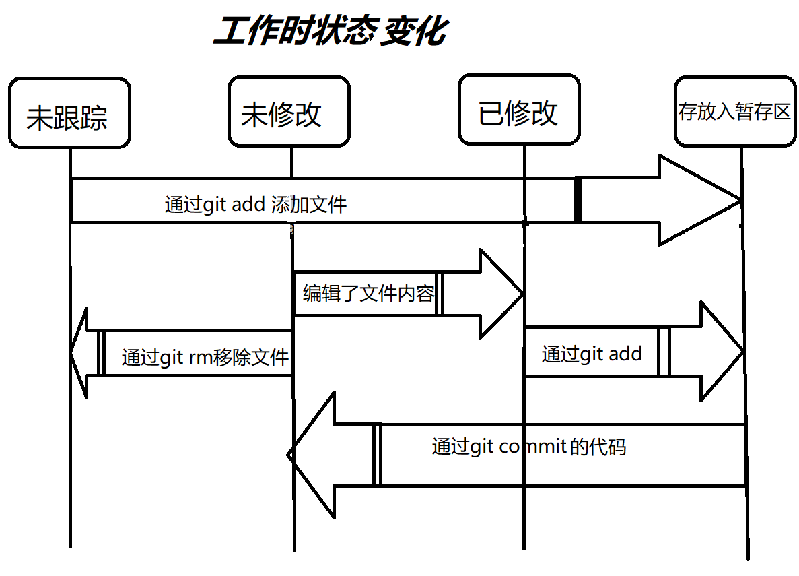

# GIT

GIT：版本控制工具，分布式版本控制系统（DVCS);

## GIT简史

1991 - 2002年间Linux维护工作很多浪费在了提交补丁和保存归档繁琐事务上

2002年项目组开始启用分布式版本控制系统BitKeeper来管理和维护代码

2005年Bitkeeper商业公司结束了与Linux开源社区的合作免费使用的权利，迫使了Linux开源社区（特别是 Linux 的缔造者 Linus Torvalds）基于使用 BitKeeper 时的经验教训，开发出自己的版本系统。 他们对新的系统制订了若干目标：

- 速度
- 简单的设计
- 对非线性开发模式的强力支持（允许成千上万个并行开发的分支）
- 完全分布式
- 有能力高效管理类似 Linux 内核一样的超大规模项目（速度和数据量）

自诞生于 2005 年以来，Git 日臻成熟完善，在高度易用的同时，仍然保留着初期设定的目标。 它的速度飞快，极其适合管理大项目，有着令人难以置信的非线性分支管理系统

>学习参考GIT官网文档


## GIT三种状态

Git 有三种状态，你的文件可能处于其中之一： **已提交（committed）**、**已修改（modified）** 和 **已暂存（staged）**

|   状态    |                             说明                             |
| :-------: | :----------------------------------------------------------: |
| committed |            表示数据已经安全地保存在本地数据库中                 |
| modified  |            表示修改了文件，但还没保存到数据库中                 |
|  staged   | 表示对一个已修改文件的当前版本做了标记，使之包含在下次提交的快照中 |

GIT项目会有三个阶段：**工作区、暂存区、Git目录**。


工作区是对项目的某个版本独立提取出来的内容。 这些从 Git 仓库的压缩数据库中提取出来的文件，放在磁盘上供你使用或修改；

暂存区是一个文件，保存了下次将要提交的文件列表信息，一般在 Git 仓库目录中。 按照 Git 的术语叫做“索引”，不过一般说法还是叫“暂存区”；

Git 仓库目录是 Git 用来保存项目的元数据和对象数据库的地方。 这是 Git 中最重要的部分，从其它计算机克隆仓库时，复制的就是这里的数据；

基本的 Git 工作流程如下：

1. 在工作区中修改文件。
2. 将你想要下次提交的更改选择性地暂存，这样只会将更改的部分添加到暂存区。
3. 提交更新，找到暂存区的文件，将快照永久性存储到 Git 目录。

> 在上提交之后，做了修改但还没有存放到暂存区域，就是**已修改**状态
>
> 文本修改后并`git add`存放到暂存区，就是**已暂存**状态
>
> Git目录保存着特定版本文件，通过`git commit`提交过的版本，就是**已提交**状态


## 初次运行配置

#### 用户信息

安装完 Git 之后，要做的第一件事就是设置你的用户名和邮件地址。 这一点很重要，因为每一个 Git 提交都会使用这些信息，它们会写入到你的每一次提交中，不可更改：

```git
$ git config --global user.name "----"
$ git config --global user.email --@--.com
```

#### 检查配置信息

命令 `git config --list`会展示所有Git当时能找到的配置

也可以通过 `git config <key>`来检查Git某一项配置

```git
$ git config --list
init.defaultbranch=master
user.name=cimu
user.email=cimu91894@qq.com
core.editor=vs
core.repositoryformatversion=0
remote.origin.url=git@github.com:CiMu001/cimublog.git
remote.origin.fetch=+refs/heads/*:refs/remotes/origin/*
branch.main.remote=origin
branch.main.merge=refs/heads/master
...


// 单项查询
$ git config user.name
cimu
```

core.editor 配置项

| 配置                                      | 说明            |
| ----------------------------------------- | --------------- |
| git config --global core.editor nano      | git默认编辑器   |
| git config --global core.editor vim       | vim编辑器       |
| git config --global core.editor gedit     | gedit编辑器     |
| git config --global core.editor notepad++ | notepad++编辑器 |
| git config --global core.editor Code      | vscode编辑器    |
| git config --global core.editor emacs     | emacs编辑器     |


## 获取帮助

Git有三种方式获取到Git命令手册：

```git
$ git help <verb>
$ git <verb> --help
$ man git-<verb>

// 例子：获取config 命令手册
$ git help config
```

同时也可以使用 `-h` 获取**可用选项**的快速手册:

```git
$ git commit -h
usage: git commit [<options>] [--] <pathspec>...

    -q, --quiet           suppress summary after successful commit
    -v, --verbose         show diff in commit message template

Commit message options
    -F, --file <file>     read message from file
    --author <author>     override author for commit
    --date <date>         override date for commit
    -m, --message <message>
                          commit message
    -c, --reedit-message <commit>
                          reuse and edit message from specified commit
    -C, --reuse-message <commit>
                          reuse message from specified commit
...
```


## Git 基础

学习配置并初始化一个仓库（repository)，开始或停止追踪(track)文件、暂存(stage)、或提交(commit)更改；

配置Git来忽略指定的文件和文件模式，撤销错误操作，浏览项目历史版本以及不同提交之间的差异，向远程仓库推送或拉取文件；

### 获取Git仓库

获取Git项目仓库分两种：

- 尚未进行版本控制的本地目录转换为Git仓库
- 从服务器克隆Git仓库

#### 初始化仓库

首先要进入到当前项目的目录下，执行 `git init`，会创建一个 `.git`的子目录，子目录含有你初始化的 Git 仓库中所有的必须文件；此时，你的项目里的文件还没有被跟踪；

通过 `git add` 命令来指定所需的文件进行追踪， `git commit`命令来提交修改；

```git
$ git add *.c
$ git add LICENSE
$ git commit -m 'initial project version'
```

#### 克隆现在仓库

克隆仓库使用 `git clone <url>`, Git 支持多种数据传输协议：`https://` 协议， SSH 传输协议， 文件下载；

```git
$ git clone https://github.com/CiMu001/50PracticeDemo.git
```


### 更新仓库代码

我们编写的代码文件都会被Git分别为 **已跟踪**、**未跟踪**两种状态；

**是否跟踪：**被指令是否使用`git add`添加过文件；

**已跟踪**文件也会存在 **未修改、已修改、已暂存**三种状态；

下图为代码文件在不同时候的状态：



#### 检查当前文件状态

可以用 `git status` 命令查看哪些文件处于什么状态。

如果你使用 `git status -s` 命令或 `git status --short` 命令，你将得到一种格式更为紧凑的输出

```git
$ git status
On branch main
Your branch is up to date with 'origin/master'.

Changes to be committed: // 指出通过add新增追踪文件， 已暂存状态；
  (use "git restore --staged <file>..." to unstage)
        new file:   src/markDown/GIT.md
        new file:   src/markDown/source/areas.png

Changes not staged for commit: // 指出修改的文件，未commit文件， 已修改状态；
  (use "git add <file>..." to update what will be committed)
  (use "git restore <file>..." to discard changes in working directory)
        modified:   postcss.config.js
        modified:   src/assets/style/markdown.scss
        modified:   src/components/MarkdownShow.vue
        modified:   src/main.js
        modified:   src/markDown/GIT.md
        modified:   "src/markDown/Vue\347\254\224\350\256\260.md"
        modified:   src/mock/markdownList.json

Untracked files:  // 指出新增的文件，未跟踪文件，未跟踪状态
  (use "git add <file>..." to include in what will be committed)
        src/markDown/source/gitworkstatechange.png

```

####  跟踪新文件

使用命令 `git add` 开始跟踪一个文件， 存到暂存区；

```git
$ git add src/markDown/source/gitworkstatechange.png
```


#### 忽略文件

可以创建一个名为 `.gitignore` 的文件，列出要忽略的文件的模式，这些文件无需纳入 Git 的管理

```git
# - -  - - - - 忽略案例  - - - - - -  -
# 忽略所有的 .a 文件
*.a

# 但跟踪所有的 lib.a，即便你在前面忽略了 .a 文件
!lib.a

# 只忽略当前目录下的 TODO 文件，而不忽略 subdir/TODO
/TODO

# 忽略任何目录下名为 build 的文件夹
build/

# 忽略 doc/notes.txt，但不忽略 doc/server/arch.txt
doc/*.txt

# 忽略 doc/ 目录及其所有子目录下的 .pdf 文件
doc/**/*.pdf
```


#### 提交更新

一般在提交更新前需要确认还有什么已修改或新建的文件还没有 `git add` 过， 否则提交的时候不会记录这些尚未暂存的变化。 所以，每次准备提交前，先用 `git status` 看下，你所需要的文件是不是都已暂存起来了， 然后再运行提交命令 `git commit`

```git
$ git commit
```

另外，你也可以在 `commit` 命令后添加 `-m` 选项，将提交信息与命令放在同一行，如下所示：

```git
$ git commit -m "此处提交修改：首页展示bug等问题"
```

请记住，提交时记录的是放在暂存区域的快照。 任何还未暂存文件的仍然保持已修改状态，可以在下次提交时纳入版本管理。 每一次运行提交操作，都是对你项目作一次快照，以后可以回到这个状态，或者进行比较。


#### 跳过暂存区

使用暂存区域的方式可以精心准备要提交的细节， 但有时候这么做略显繁琐，只要在提交的时候，给 `git commit` 加上 `-a` 选项，Git 就会自动把所有**已经跟踪过的文件**暂存起来一并提交，从而跳过 `git add` 步骤：

```git
$ git commit -a -m "添加git学习笔记、更新vue学习笔记"
[main 5217061] 添加git学习笔记、更新vue学习笔记
 9 files changed, 740 insertions(+), 17 deletions(-)
 create mode 100644 src/markDown/GIT.md
 create mode 100644 src/markDown/source/areas.png
 create mode 100644 src/markDown/source/gitworkstatechange.png

```


#### 移除文件

要从 Git 中移除某个文件，就必须要从已跟踪文件清单中移除（确切地说，是从暂存区域移除）

可以用 `git rm` 命令完成此项工作，并连带从工作目录中删除指定的文件，这样以后就不会出现在未跟踪文件清单中了

```git
$ git rm PROJECTS.md
rm 'PROJECTS.md'
```

 如果要删除之前修改过或已经放到暂存区的文件，则必须使用强制删除选项 `-f`（译注：即 force 的首字母）。


### 查看提交历史

在提交了若干更新，又或者克隆了某个项目之后，你也许想回顾下提交历史。 完成这个任务最简单而又有效的工具是 `git log` 命令

```git
$ git log
commit 5217061089f86a79b7bc91479108576adf8ec8ff (HEAD -> main)
Author: cimu <cimu91894@qq.com>
Date:   Mon Mar 27 17:48:45 2023 +0800

    添加git学习笔记、更新vue学习笔记

commit 199b17c0a021663f4ac30b4e2d8447e04ef798d3 (origin/master)
Author: cimu <cimu91894@qq.com>
Date:   Wed Mar 22 11:30:29 2023 +0800

    第一次上传
```

不传入任何参数的默认情况下，`git log` 会按时间先后顺序列出所有的提交，最近的更新排在最上面


**`-p` 或 `--patch`选项**

它会显示每次提交所引入的差异，你可以限制显示的日志条目数量，例如使用 `-1` 选项来只显示最近的两次提交：

```git
$ git log -p -1
commit 5217061089f86a79b7bc91479108576adf8ec8ff (HEAD -> main)
Author: cimu <cimu91894@qq.com>
Date:   Mon Mar 27 17:48:45 2023 +0800

    添加git学习笔记、更新vue学习笔记
```


**`stat` 选项**

看到每次提交的简略统计信息

```git
$ git log --stat
commit 5217061089f86a79b7bc91479108576adf8ec8ff (HEAD -> main)
Author: cimu <cimu91894@qq.com>
Date:   Mon Mar 27 17:48:45 2023 +0800

    添加git学习笔记、更新vue学习笔记

 postcss.config.js                             |   8 +-
 src/assets/style/markdown.scss                |   2 +
 src/components/MarkdownShow.vue               |   7 +-
 src/main.js                                   |   2 +-
 src/markDown/GIT.md                           | 259 ++++++++++++++
 "src/markDown/Vue\347\254\224\350\256\260.md" | 472 +++++++++++++++++++++++++-
 src/markDown/source/areas.png                 | Bin 0 -> 18502 bytes
 src/markDown/source/gitworkstatechange.png    | Bin 0 -> 45337 bytes
 src/mock/markdownList.json                    |   7 +
 9 files changed, 740 insertions(+), 17 deletions(-)

commit 199b17c0a021663f4ac30b4e2d8447e04ef798d3 (origin/master)
Author: cimu <cimu91894@qq.com>
Date:   Wed Mar 22 11:30:29 2023 +0800

    第一次上传

 .browserslistrc                                    |     6 +
 .eslintrc.js                                       |    20 +
 .gitignore                                         |    23 +
 README.md                                          |    29 +
 babel.config.js                                    |     5 +
 jsconfig.json                                      |    19 +

```


**`--pretty`选项**

可以使用不同于默认格式的方式展示提交历史

比如 `oneline` 会将每个提交放在一行显示，在浏览大量的提交时非常有用。 另外还有 `short`，`full` 和 `fuller` 选项

```git
$ git log --pretty=oneline
ca82a6dff817ec66f44342007202690a93763949 changed the version number
085bb3bcb608e1e8451d4b2432f8ecbe6306e7e7 removed unnecessary test
a11bef06a3f659402fe7563abf99ad00de2209e6 first commit
```


**`format`**

可以定制记录的显示格式

```git
$ git log --pretty=format:"%h - %an, %ar : %s"
ca82a6d - Scott Chacon, 6 years ago : changed the version number
085bb3b - Scott Chacon, 6 years ago : removed unnecessary test
a11bef0 - Scott Chacon, 6 years ago : first commit
```

`format`常用的选项

| 选项 | 说明                                          |
| ---- | --------------------------------------------- |
| %H   | 提交的完整哈希值                              |
| %h   | 提交的简写哈希值                              |
| %T   | 树的完整哈希值                                |
| %t   | 树的简写哈希值                                |
| %P   | 父提交的完整哈希值                            |
| %p   | 父提交的简写哈希值                            |
| %an  | 作者名字                                      |
| %ae  | 作者的电子邮件地址                            |
| %ad  | 作者修订日期（可以用 --date=选项 来定制格式） |
| %ar  | 作者修订日期，按多久以前的方式显示            |
| %cn  | 提交者的名字                                  |
| %ce  | 提交者的电子邮件地址                          |
| %cd  | 提交日期                                      |
| %cr  | 提交日期（距今多长时间）                      |
| %s   | 提交说明                                      |

`git log` 的常用选项

| 选项            | 说明                                                         |
| --------------- | ------------------------------------------------------------ |
| -p              | 按补丁格式显示每个提交引入的差异                             |
| --stat          | 显示每次提交的文件修改统计信息                               |
| --shortstat     | 只显示 --stat 中最后的行数修改添加移除统计                   |
| --name-only     | 仅在提交信息后显示已修改的文件清单                           |
| --name-status   | 显示新增、修改、删除的文件清单                               |
| --abbrev-commit | 仅显示 SHA-1 校验和所有 40 个字符中的前几个字符              |
| --relative-date | 使用较短的相对时间而不是完整格式显示日期（比如“2 weeks ago”） |
| --graph         | 在日志旁以 ASCII 图形显示分支与合并历史                      |
| --pretty        | 使用其他格式显示历史提交信息。可用的选项包括 oneline、short、full、fuller 和 format（用来定义自己的格式） |
| --oneline       | `--pretty=oneline --abbrev-commit` 合用的简写                |


### 撤销操作

#### 补充提交

有时候我们提交完了才发现漏掉了几个文件没有添加，或者提交信息写错了。 此时，可以运行带有 `--amend` 选项的提交命令来重新提交：

```git
// 先进行一次提交
$ git commit -m '练习提交流程，忽略文件，'
[master 876f3d5] 练习提交流程，忽略文件，
 2 files changed, 22 insertions(+)
 create mode 100644 .gitignore
 create mode 100644 index.html
 
// 如何 git status查看发现还有未提交
$ git status
On branch master
Changes not staged for commit:
  (use "git add <file>..." to update what will be committed)
  (use "git restore <file>..." to discard changes in working directory)
        modified:   "test.txt"

no changes added to commit (use "git add" and/or "git commit -a")

// 然后开始补充提交
$ git add .
$ git commit --amend


// 查看记录  只会有一条
$ git log
commit 4f2c86081a5a90c66a11b066e8f66d8cb0580136 (HEAD -> master)
Author: cimu <cimu91894@qq.com>
Date:   Wed Mar 29 17:17:51 2023 +0800

    练习提交流程，忽略文件，
```

> git commit --amend 是补充上次commit， 最终你只会有一个提交；


#### 取消暂存的文件

意外的 `add`了不希望暂存的文件， 可以通过 `git reset HEAD <file>`来取消暂存的文件：

```git
// 意外提交
$ git add *
$ git status
On branch master
Changes to be committed:
  (use "git restore --staged <file>..." to unstage)
        new file:   1.txt
        new file:   2.txt

// 取消暂存 1.txt
$ git reset HEAD 1.txt
$ git status
On branch master
Changes to be committed:
  (use "git restore --staged <file>..." to unstage)
        new file:   2.txt

Untracked files:
  (use "git add <file>..." to include in what will be committed)
        1.txt


```


#### 撤消对文件的修改

如果你并不想保留对文件的修改，`git checkout --  <file>` 撤消修改——将它还原成上次提交时的样子（或刚克隆后）:

```git
// 做了修改后查看
$ git status
On branch master
Changes not staged for commit:
  (use "git add <file>..." to update what will be committed)
  (use "git restore <file>..." to discard changes in working directory)
        modified:   2.txt

no changes added to commit (use "git add" and/or "git commit -a")

// 撤销 2.txt文件的修改
$ git checkout -- 2.txt
$ git status
On branch master
nothing to commit, working tree clean
```


### 远程仓库的使用

远程仓库是指托管在因特网或其他网络中的你的项目的版本库，与他人协作涉及管理远程仓库以及根据需要推送或拉取数据； 

管理远程仓库包括了解如何添加远程仓库、移除无效的远程仓库、管理不同的远程分支并定义它们是否被跟踪等等

#### 添加远程仓库

运行 `git remote add <shortname> <url>` 添加一个新的远程 Git 仓库：

```git
$ git remote add gitTest https://github.com/CiMu001/gitTest.git

$ git remote  -v
gitTest https://github.com/CiMu001/gitTest.git (fetch)
gitTest https://github.com/CiMu001/gitTest.git (push)
```

> 这边与其说是添加仓库不如说是**对已有仓库进行关联**，需要先新建好仓库，获取仓库地址，然后进行关联；
>
> 如果你使用 `clone` 命令克隆了一个仓库，命令会自动将其添加为远程仓库并默认为 “origin” 


#### 推送到远程仓库

 这个命令很简单：`git push <remote> <branch>`：

```git
// 我这边好像是<remote>写错了。。。
$ git push origin main
error: src refspec main does not match any
error: failed to push some refs to 'origin'

$ git branch -m master main

$ git push gitTest main
Enumerating objects: 12, done.
Counting objects: 100% (12/12), done.
Delta compression using up to 12 threads
Compressing objects: 100% (9/9), done.
Writing objects: 100% (12/12), 1.16 KiB | 1.16 MiB/s, done.
Total 12 (delta 2), reused 0 (delta 0), pack-reused 0
remote: Resolving deltas: 100% (2/2), done.
To https://github.com/CiMu001/gitTest.git
 * [new branch]      main -> main
```

> github 目前创建项目主分支是main， 但git默认本地分支为master，需要切换到main才能正常提交
>
> `$ git branch -m master main`


通过 `git push -u <origin> <branch>`可以推送到一个**新的远程分支**上；

```git
$ git add .

$ git commit -m '测试'
[cimu de16918] 测试
 2 files changed, 10 insertions(+), 1 deletion(-)

$ git push -u gitTest cimu
Enumerating objects: 7, done.
Counting objects: 100% (7/7), done.
Delta compression using up to 12 threads
Compressing objects: 100% (4/4), done.
Writing objects: 100% (4/4), 361 bytes | 361.00 KiB/s, done.
Total 4 (delta 2), reused 0 (delta 0), pack-reused 0
remote: Resolving deltas: 100% (2/2), completed with 2 local objects.
remote:
remote: Create a pull request for 'cimu' on GitHub by visiting:
remote:      https://github.com/CiMu001/gitTest/pull/new/cimu
remote:
To https://github.com/CiMu001/gitTest.git
 * [new branch]      cimu -> cimu
branch 'cimu' set up to track 'gitTest/cimu'.
```


#### 查看远程仓库

如果想要查看某一个远程仓库的更多信息，可以使用 `git remote show <remote>` 命令:

```git
$ git remote show origin
fatal: 'origin' does not appear to be a git repository
fatal: Could not read from remote repository.

Please make sure you have the correct access rights

$ git remote
gitTest

$ git remote show gitTest
* remote gitTest
  Fetch URL: https://github.com/CiMu001/gitTest.git
  Push  URL: https://github.com/CiMu001/gitTest.git
  HEAD branch: main
  Remote branches:
    cimu tracked
    main tracked
  Local branch configured for 'git pull':
    cimu merges with remote cimu
  Local refs configured for 'git push':
    cimu pushes to cimu (up to date)
    main pushes to main (up to date)
```


#### 从远程仓库中抓取与拉取

从远程仓库中获得数据，可以执行 `$ git fetch <remote>`：

```git
$ git fetch gitTest
remote: Enumerating objects: 4, done.
remote: Counting objects: 100% (4/4), done.
remote: Compressing objects: 100% (3/3), done.
remote: Total 3 (delta 1), reused 0 (delta 0), pack-reused 0
Unpacking objects: 100% (3/3), 756 bytes | 75.00 KiB/s, done.
From https://github.com/CiMu001/gitTest
   de16918..89d74b8  cimu       -> gitTest/cimu
```

这个命令会访问远程仓库，从中拉取所有你还**没有的数据**。 执行完成后，你将会拥有那个远程仓库中**所有分支**的引用，可以随时**合并或查看**:

```git
$ git fetch gitTest
remote: Enumerating objects: 8, done.
remote: Counting objects: 100% (8/8), done.
remote: Compressing objects: 100% (6/6), done.
remote: Total 6 (delta 2), reused 0 (delta 0), pack-reused 0
Unpacking objects: 100% (6/6), 1.56 KiB | 99.00 KiB/s, done.
From https://github.com/CiMu001/gitTest
   89d74b8..a525124  cimu       -> gitTest/cimu
   99d6129..b23c2c6  main       -> gitTest/main

cimu9@CiMuBookPro MINGW64 /d/code Progarm/前端学习记录/git项目/git练习项目 (cimu)
$ git merge
Updating 89d74b8..a525124
Fast-forward
 ...260\345\273\272\350\277\234\347\250\213\346\226\207\344\273\266-cimu" | 1 +
 1 file changed, 1 insertion(+)
 create mode 100644 "\346\226\260\345\273\272\350\277\234\347\250\213\346\226\207\344\273\266-cimu"

```

> 在main和cimu分支上新增了文件，通过 git fetch后拉取了所有的分支的数据；
>
> 拉取数据后，会需要自己在执行 git merge进行合并分支操作；
>
> 目前本地分支是在cimu分支下，所以进行合并也是合并gitTest/cimu分支拉取的内容


#### 远程仓库的重命名与移除

你可以运行 `git remote rename` 来修改一个远程仓库的简写名。 例如，想要将 `gitTest` 重命名为 `dev`，可以用 `git remote rename` 这样做：

```git
$ git remote rename gitTest dev
Renaming remote references: 100% (2/2), done.

$ git remote
dev
```

如果因为一些原因想要移除一个远程仓库——你已经从服务器上搬走了或不再想使用某一个特定的镜像了， 又或者某一个贡献者不再贡献了——可以使用 `git remote remove` 或 `git remote rm` ：

```git
$ git remote remove dev
$ git remote
空 ~
```

一旦你使用这种方式删除了一个远程仓库，那么所有和这个远程仓库相关的远程跟踪分支以及配置信息也会一起被删除。
