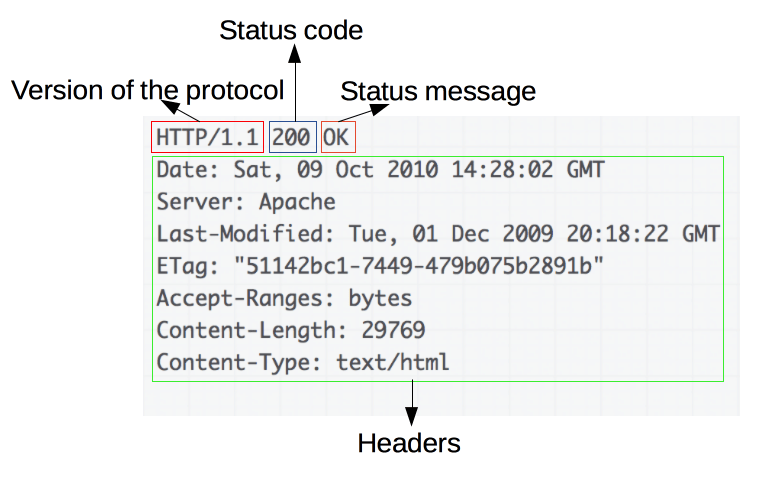

# HTTP

**超文本传输协议**: 传输超媒体文档的应用层协议，为Web浏览器与服务器之间通信设计，遵循**客户端/服务器**模型，为**无状态协议**。

## 概述

HTTP协议通过客户端和服务端通过交换各自的消息（与数据流正好相反）进行交互，由像浏览器这样的客户端发出的消息叫做**请求（request）**，被服务端响应的消息叫做**响应（response）**。

每一个发送到服务器的请求，都会被服务器处理并返回一个响应，请求与响应之间，还有许许多多的被称为[代理](https://developer.mozilla.org/zh-CN/docs/Glossary/Proxy_server)的实体，他们的作用与表现各不相同，比如有些是网关，还有些是 [cache](https://developer.mozilla.org/zh-CN/docs/Glossary/Cache) 等。

**可扩展的协议**

通过**TCP**或**TLS**(加密的TCP)连接来发送，论上任何可靠的传输协议都可以使用，所以有着良好的可扩展性，它不仅被用来传输超文本文档，还用来传输图片、视频或者向服务器发送如 HTML 表单这样的信息。

**客户端（user-agent）**

请求通过实体被发出，实体就是，大多数指浏览器也可以为其他，如：爬取网页的爬虫、开发人员调试应用程序。

**Web 服务端**

由Web Server服务提供客户端所请求的文档，Server 只是虚拟意义上代表一个机器：它可以是共享负载（负载均衡）的一组服务器组成的计算机集群，也可以是一种复杂的软件，通过向其他计算机（如缓存，数据库服务器，电子商务服务器 ...）发起请求来获取部分或全部资源。

**代理（Proxy）**

代理主要有如下几种作用：

- 缓存（可以是公开的也可以是私有的，像浏览器的缓存）
- 过滤（像反病毒扫描，家长控制...）
- 负载均衡（让多个服务器服务不同的请求）
- 认证（对不同资源进行权限管理）
- 日志记录（允许存储历史信息）

### HTTP基本性质

#### 简单性

虽然下一代 HTTP/2 协议将 HTTP 消息封装到了帧（frame）中，HTTP 大体上还是被设计得简单易读。HTTP 报文能够被人读懂，还允许简单测试，降低了门槛，对新人很友好。

#### 可扩展性

HTTP/1.0 中出现的HTTP标头（header）让协议扩展变得非常容易，只要服务器和客户端新标头达成语义一致。

#### 无状态

HTTP 是无状态的：在同一个连接中，两个执行成功的请求之间是没有关系的。这就带来了一个问题，用户没有办法在同一个网站中进行连续的交互，比如在一个电商网站里，用户把某个商品加入到购物车，切换一个页面后再次添加了商品，这两次添加商品的请求之间没有关联，浏览器无法知道用户最终选择了哪些商品。而使用 HTTP 的标头扩展

> 无状态： 指协议对事物处理没有记忆能力，不保存状态，每个请求都是独立的。
>
> 注意，HTTP 本质是无状态的，使用 Cookie 可以创建有状态的会话。

#### HTTP 连接

连接是由传输层来控制的，根本上不属于 HTTP 的范围，HTTP 并不需要其底层的传输层协议是面向连接的，只需要它是可靠的（不丢失消息），常用可靠的传输层协议为TCP，因此HTTP依赖于面向连接的 TCP 进行消息传递，但并不是必须的。

在C / S 之间进行交互之前，必须需要在这两者间多次往返交换消息建立一个 TCP 链接，HTTP/1.0 默认为每一对 HTTP 请求/响应都打开一个单独的 TCP 连接。当需要连续发起多个请求时，这种模式比多个请求共享同一个 TCP 链接更低效。

为了减轻这些缺陷，HTTP/1.1 引入了流水线和持久连接的概念：底层的 TCP 连接可以通过`Connection`标头来被部分控制。HTTP/2 则发展得更好，通过在一个连接复用消息的方式来让这个连接始终保持为暖连接。

> 为了更好的适合 HTTP，Google 就研发了一种以 UDP 为基础，能提供更可靠更高效的传输协议`QUIC`

### HTTP 报文

HTTP/1.1 以及更早的 HTTP 协议报文都是语义可读的，在 HTTP/2 中，这些报文被嵌入到了一个新的二进制结构，帧（frame）。帧允许实现很多优化，比如报文标头的压缩以及多路复用。

HTTP 报文的类型有两种，请求报文与响应报文，每种都有其特定的格式。

**请求报文：**

请求报文元素组成：

- **Method:**  HTTP 的请求方法，常用有 `GTE`、`POST`，或 `OPTIONS`、`HEAD`来定义客户端的动作行为。
- **Path：**获取的资源的路径， 元素资源的 URL， 不包含协议（http://）、`domain`(域)、TCP的`port`(端口号)。
- **Version of protocol:** HTTP 协议版本号。
- **Headers：** 为服务器传递其他信息的可选标头（header）。
- **Body：** 像 POST 这样的方法，报文的主体（body）就包含了发送的资源，这与响应报文的主体类似。

**响应报文：**

响应报文元素组成：

- **Version of protocol:**  HTTP 协议版本号。
- **Status code:** 状态码，来告知对应请求执行成功或失败，以及失败的原因。
- **Status message:**  状态信息, 这个信息是非规范性的状态码描述信息，由服务端自行设定。
- **Headers：** 为服务器传递其他信息的可选标头（header）。
- **Body:** 可选自定义项, 获取资源的主体。

### 基于HTTP 的API

最常用基于 HTTP 的 API 为 [`XMLHttpRequest`](https://developer.mozilla.org/zh-CN/docs/Web/API/XMLHttpRequest) ，可用于在 [user agent](https://developer.mozilla.org/zh-CN/docs/Glossary/User_agent) 和服务器之间交换数据。现代 [`Fetch API`](https://developer.mozilla.org/zh-CN/docs/Web/API/Fetch_API) 提供相同的功能，具有更强大和灵活的功能集。

另一种 API，即服务器发送的事件，是一种单向服务，允许服务器使用 HTTP 作为传输机制向客户端发送事件。

> 完全不知道是什么。。。 服务器推送订阅信息用的API？

