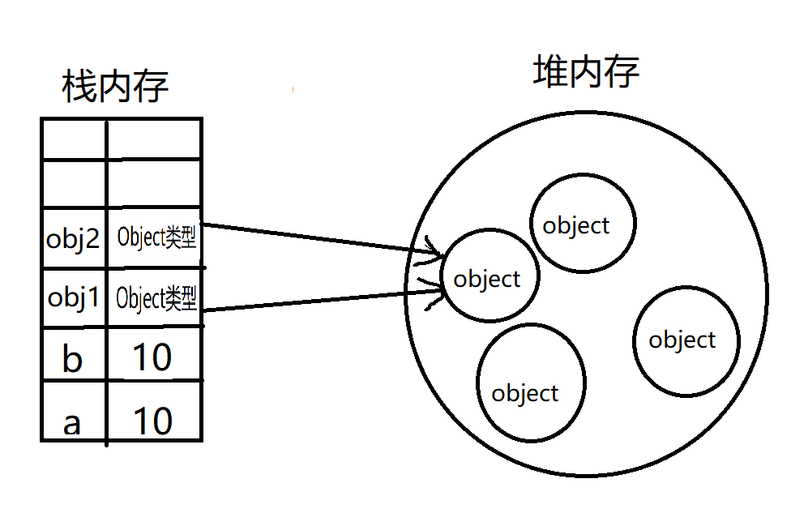
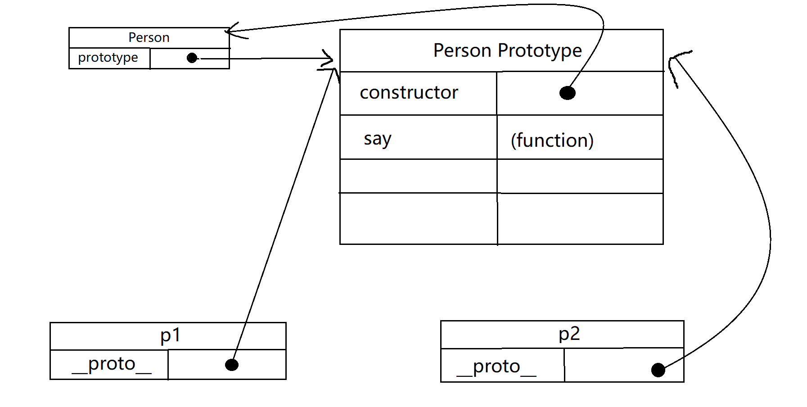

# JavaScript

JavaScript(JS)是一种具体**函数优先**特性的轻量级、**解释型**（即时编译）的编程语言。作为Web页面的脚本语言，但也被用到很多非浏览器环境中，比如Node.js等；

JavaScript是一种基于**原型**、多范式、**单线程**动态语言，支持面对对象，命令式和声明式风格；    -- MDN


## JavaScript简史

JavaScript的问世主要是为了解决在低速带宽网络时代下数据的服务器通信验证问题，最初存在网景和微软两个不同版本，两个版本并没有统一的标准化，1997年，JavaScript1.1交给了欧洲计算机制造商协会进行了"标准化"，经过了数月打造出了ECMA-262，也就是ECMAScript，随后各家浏览器均以ECMAScirpt作为自己的JavaScript实现依据。

JavaScript远远不限于ECMAScript，完整的JavaScript由**ECMAScript**(核心语法)、**DOM**（文档对象模型）、**BOM**（浏览器对象模型）三个部分组成。ECMAScript并没有对DOM进行规范，该模型由万维网联盟（W3C)制定。


## What is ES6?

**ES6**，ECMA-262的第六版，所以被称为ES6，又因是于2015年发布，被称为**ES2015**，这是一个包含规范成立来最重要的一批增强特性，开始正式支持类、模块、迭代器、生成器、箭头函数、期约、代理和众多新数据类型。 


## 基本语法

- **区分大小写**
- **标识符**： 变量、函数、属性或者函数参数的名称，
  - 组成规范：标识符由一个或多个字母、数字、下划线或美元符组成，并首字符必须要为字母、下划线或美元符

  - 命名推荐规范： **驼峰大小写**，即首个单词首字母小写，后面每个字母首字母大写，例：`myCar`


- **注释**： 采用C语言风格：`// 单行注释`，`/* 多行注释  */`


- **严格模式**: ES 5 增加了**严格模式**，严格模式下会对JavaScript语法的要求更加严格，使用 `"use strict"`来开启严格模式


- **语句结束符号**： ES 可以使用 `;`结尾，也可以不使用，但不推荐，加分号结尾可以使解析器更好确定语句在哪里结束


- **关键字**，标识符不可以出现关键字

  | break   | do       | in         | typeof   | const   |
  | ------- | -------- | ---------- | -------- | ------- |
  | case    | else     | instanceof | var      | finally |
  | catch   | export   | new        | void     | super   |
  | class   | extends  | return     | while    | with    |
  | default | function | this       | continue | for     |
  | switch  | yield    | delete     | if       | throw   |
  | import  | try      |            |          |         |

- ECMA-262规定了一组**未来保留字**，如下

  | enum      | implements | package   |
  | --------- | ---------- | --------- |
  | protected | static     | interface |
  | let       | private    | await     |
  | public    |            |           |


### 变量定义

ECMAScript变量是**松散类型**（弱类型）的，意味了变量没有固定的数据类型，变量只是用于保存任意值的命名占位符，有三个关键字可以声明变量：var、let、const;其中var在所有版本中都可以使用，const和let只能在ES6版本后使用

### var

```javascript
var msg;
var msg2 = 'halo';  //  允许
```

在没有赋值的情况下，变量会保存一个特殊值 `undefined`

var声明变量具有**函数作用域**

在全局下定义var变量和函数都会成为window对象的属性和方法

```javascript
function test() {
    var msg = 'hi';  //  函数局部变量
}
test();
console.log(msg); // 出错
```

var变量会存在**变量提升**，也就是var声明的变量会被自动提升到函数作用域的顶部，可多次进行声明，值为最后一次的赋值；

```javascript
function fun(){
    console.log(age);
    var age = 18;
    var age = 19;
}
fun();

// 上面代码会等同于下面代码
function fun(){
    var age = 18;
    var age = 19;
    console.log(age);
}
fun();
```

### let

```javascript
let msg;
let msg = 'hi'; //报错， age标识符已声明
```

let和var作用相似，let声明具有**块级作用域**， ES6新增语法

let不允许在同一个块级作用域能重复声明，会抛出SyntaxError

let声明的变量不会在作用域中被提升，存在**暂时性死区**（从代码块开始到执行到声明变量之前），在变量处于暂时性死区之中，访问变量会抛出ReferenceError

### const

```javascript
const msg = 'hi';
```

const 和let特性基本相同，具有**块级作用域**，不存在变量提升，不可以重复定义，ES6新增语法

const定义的是**常量**，在定义时必须进行**赋初始值**，并无法对const声明的变量进行修改，尝试修改会导致报错。

const也具有**暂时性死区**


> **风格推荐**：
> *推荐使用const优先，let其次，不推荐使用var*


### 原始值和引用值

ECMAScript变量可以包含为两种不同类型的数据：**原始值**和**引用值**，原始值就是最简单的数据，引用值是由多个值构成的对象。

JS中保存原始值的变量是**按值**访问，操作的就是存储在变量中的实际值，引用值是保存在内存中的变量，JS不能直接操作对象所在的内存空间，操作对象实际是操作对象的引用，引用值的变量是**按引用**访问的

变量的复制也是存在不同的，把一个原始值的变量赋值给另一个变量时，原始值会被复制到新的变量位置，两个变量都是独立使用，互不干扰。把一个引用值从一个变量复制给另一个变量时，存储在变量中的值会被复制到新变量的内存位置，但这里复制的值实际是一个指针，指针指向存储在堆内存中的对象



```javascript
let obj1 = { name: 'cimu', age: 18 };
let obj2 = obj1;

obj2.name = 'chai';
console.log(obj1.name); 		// 'chai', 引用传递， 实际修改的还是堆内存同一个对象
```


### 执行上下文与作用域

执行上下文的概念在JS中颇为重要，变量或函数的执行上下文决定了它们可以访问那些数据，执行上下文可以分为**全局上下文**、**函数上下文**和**块级上下文**，执行上下文中的代码在执行时，会创建一个变量对象的一个作用域链，用于搜索变量和函数。

函数和块级上下文可以访问自己作用域的变量，也可以访问任何包含的执行上下文乃至全局上下文中的变量

全局上下文只能访问全局上下文的变量和函数，不能直接访问局部上下文中的任何数据


### 垃圾回收机制

JS是使用垃圾回收的语言，通过自动内存管理实现内存分配和闲置资源回收，离开作用域的值就会被自动标记为可回收，然后在垃圾回收期间被删除，在浏览器的发展史上主要用到过**标记清理**和**引用计数**


### 内存泄漏

写不好的JS代码可能难以察觉内存泄漏问题，在内存有限设备或函数在被多次调用的情况下，内存泄漏可能会造成大问题，JS中常见的内存泄露有：

- 意味声明的全局变量， 例： 当不用关键字申明了一个变量，会被定义在window下作为全局变量

  ```javascript
  function fun(){
      name = 'CIMu';
  }
  ```

- 定时器， 只要定时器运行回调函数中的变量就会一直占用内存

  ```javascript
  let name = 'CiMu';
  
  setInterval( () => { console.log(name) }, 1000);
  ```

- 闭包的使用

  ```javascript
  let outer = function() {
  	let name = 'CiMu';
  	return function () {
  		return name;
  	}
  }
  ```

  调用outer会分配name内存空间，只要返回的函数存在就不能清理name，闭包一直在引用它。


## 数据类型

最新的ECMAScript定义了8中不同的数据类型：

### 简单数据类型

- **Boolean**(布尔型)，有两个值： `true`和 `false`
- **null**，一个表明null值的特殊关键字。
- **undefined**, 和null一样是一个特殊的关键字，undefined表示变量未赋值时的属性
- **Number**（数字)，整数或者浮点数，用IEE 754格式表示 例： `36`， `3.14`

  - 存在特殊值 `NaN` 表示不是数值，超过表示数值范围用 `Infinity`（无穷大）
  - 提供了一个`isNaN()`函数判断是否“不是一个数值”， isNaN函数会默认转换参数`"1"` 和 `1`为相同结果
  - 提供 `parseInt、parseFloat`函数转换为数值

  ```javascript
  // 字符串转换数字
  parseInt('123asd');
  // 123
  parseFloat('ads123');
  // NaN
  parseInt('1sd23');
  // 1
  parseInt('NaN');
  // NaN
  ```

  - 当被当为数字时： `undefined`转换数字为`NaN`， `null || false`转换数字为`0`，`true`为`1`
- **BigInt**（任意精度的整数)，可以安全地存储和操作大整数，甚至可以超过数字的安全整数限制。
- **String**（字符串)，一串表示字符序列，可以使用单引号（`'str'`）或双引号（`"str"`）或反引号（\`\`）标示

  - 提供 `toString()`方法转换为字符串
  - ES6新增了模板字符串`反引号表示->`（\`\`）可以保留换行字符，跨行定义字符串，也可以通过`${}`进行字符串插值，例：


```javascript
const x = 1;
const y = 2;
console.log(`x + y = ${x + y}`);
```

- **Symbol**，一种实例是唯一且不可改变的数据类型


### 复杂数据类型

复杂数据类型对象（**Object**）引用访问 		-- 复杂数据类型后面会展开说明


### typeof操作符

JS中`typeof()`可以用来**判断简单数据类型**，在判断复杂数据类型时不能准确判断，判断结果返回以下值：

| `undefined` 表示值未定义 | `boolean` 表示值为布尔型       | `string`  表示值为字符串 |
| ------------------------ | ------------------------------ | ------------------------ |
| `number` 表示值为数值    | `object` 表示值为对象或 `null` | `function `表示值为函数  |
| `symbol` 表示值为符号    |                                |                          |


## 操作符

| 自增自减（--）（++） | 按位非（~）            | 按位与（&）                           | 按位或（\|） | 按位异或（^）     |
| -------------------- | ---------------------- | ------------------------------------- | ------------ | ----------------- |
| 左移（<<）           | 有符号右移（>>）       | 无符号右移（>>>）                     | 逻辑非( ! )  | 逻辑与（ && ）    |
| 逻辑或（ \|\| ）     | 指数（ ** ）           | 加减乘除取余（+）（-）（*）（/）（%） | 赋值（=）    | 逗号操作符（ , ） |
| 条件操作符（ ? :  ） | 等于和不等（==）（!=） | 关系操作符（>）（<）（>=）（<）       | 全等（===）  | 全不等（！==）    |

### 全等和等于区别

等于和不等（==）（!=）这两个操作符都会进行**强制类型转换**再比较，转换规则：

- 任意一个操作数为布尔型，会转换为数值再进行比较
- 存在一个操作数为字符串，另一个为数值，会转换为数值再进行比较
- 操作数中一个是对象，会调用对象的 `valueOf()`取值后进行比较

全等和全不等（ === ）（ !== ）直接进行值的比较，数据类型不同不会进行强制转换


## 语句

JS中的语句使用风格都和C语言类似

| if - else   条件判读语句 | while 循环语句            | do-while 先执行循环语句   |
| ------------------------ | ------------------------- | ------------------------- |
| for 循环语句             | for - in 遍历数组或字符串 | for - of 遍历数组或字符串 |
| break 循环退出           | continue 跳过本次循环     | with                      |
| switch                   |                           |                           |


## 基本引用类型

引用值（对象）是某个特定引用类型的实例，可以通过**new**关键字加上一个**构造函数**来创建。

为了帮助开发者实现常见的任务，ES提供了很多原生引用类型例如：Date（提供日期时间的操作），RegExp（正则表达式操作）,

为了方便操作原始值，ES还提供了三种特殊的引用类型：Boolean，Number，String，可以使原始值具有其他引用类型值的特性，当用到原始值的某个方式或属性时，后台都会创建一个相应原始包装类型的对象，来调用原始值的各种方法

```javascript
let s1 = 'nihao zaijian';
let s2 = s1.substr(6);   //  使用了substr方法

let now = new Date();
```

上面第二行代码，后台都会执行以下3步：

- 创建一个String 类型的实例；
- 调用实例上的特定方法；
- 销毁实例；

全局上下文中还存在两个内置对象： Global 和 Math，Global对象浏览器将其实现为window对象，isNaN()， parseInt()实际上都是Global对象的方法。Math是ES提供的一个处理数学公式、信息和计算的地方，提供一些辅助计算的属性和方法。


### Number

Number是对应数值的引用类型，可以使用new Number构造函数创建一个Number对象，在不创建对象的情况下，也可以直接使用Number上的方法，JS会在后台创建使用销毁；Number提供方法如下：

- **toFixed()**: 返回指定小数点位数的数值字符串

  ```javascript
  let num = 10;
  
  console.log(num.toFixed(2));		// '10.00'
  ```

- **toExponential():**  返回以科学计数法表示的数值字符串

  ```javascript
  let num = 10;
  
  console.log(num.toExponential(1)); 		// '1.0e+1'
  ```

- **toPrecision()**: 根据参数返回最合理的输出结果，可能是固定长度，也可能是科学计数法

  ```javascript
  let num = 10;
  
  console.log(num.toPrecision(1)); 		// '1.0e+1'
  console.log(num.toPrecision(2)); 		// '10'
  console.log(num.toPrecision(3)); 		// '10.0'
  ```

- ​	**isNaN():** 判断参数是否为NaN, 只能精准的判断是否是NaN；其他都为false

  ```javascript
  Number.isNaN('1')
  // false
  Number.isNaN(1)
  // false
  Number.isNaN('dfafadfasdf')
  // false
  Number.isNaN("@#!")
  // false
  Number.isNaN(NaN)
  // true
  ```

  

### String

String是对应字符串的引用类型，可以使用String构造函数new一个实例，在不创建对象的情况下，也可以直接使用String上的方法，JS会在后台创建使用销毁；String提供操作属性方法如下：

- **length:**   字符串的字符数量

  ```javascript
  const str = '123';
  console.log(str.length);
  ```
- **concat():**  字符串拼接，返回一个新的字符串, 不会修改原本变量

  ```javascript
  let str1 = '123';
  let str2 = '456';
  console.log(str1.concat(str2));
  ```
- **slice()**: 提取字符串元素， 接收两个参数：开始下标， 结束下标（不包括），参数为负数时用length加上负值的下标位置

  ```javascript
  const str = '123abc';
  console.log(str.slice(2));     			//   3abc
  console.log(str.slice(0,3));			//   123
  console.log(str.slice(-1));				//   c
  console.log(str.slice(0,-2));			//   123a
  ```
- **substring:**  提取字符串元素，接收两个参数： 开始下标， 结束下标（不包括）

  ```javascript
  console.log(str.substring(2));     
  console.log(str.substring(0,3));			
  console.log(str.substring(-1));				
  console.log(str.substring(0,-2)); 			//   结果和用法和slice相同
  ```
- **substr():**  提取字符串元素，接收两个参数： 开始下标，个数
- **indexOf()**: 查询字符串，成功返回下标，失败返回-1，从开始位置开始查询
- **lastIndexof()**:  查询字符串，成功返回下标，失败返回-1，从结束位置开始查询
- **startsWith()**: 查询是否以“参数”开头，返回布尔值
- **endsWith()**:  查询是否以“参数”结尾， 返回布尔值
- **includes()**: 查询是否包含参数，返回布尔值
- **trim()**: 删除字符串开头和结束部分的空白符，不影响原字符串，返回新字符串
- **repeat()**:  重复指定的字符串，接收一个参数指定重复的次数，返回一个新的字符串
- **padStart()**:  从开头位置填充字符，接收两个参数： 填充的长度，填充的字符（不填默认为空格），填充的字符长度小于指定长度会重复字符，下面方法同理
- **padend():**   从结束位置填充字符，接收两个参数： 填充的长度，填充的字符（不填默认为空格）
- **toLowerCase() / toLocaleLowerCase():** 转换为小写
- **toUpperCase() / toLocaleUpperCase():** 转换为大写


### 字符串的迭代与解构

字符串原型上暴露了@@iterator（迭代器）方法，字符串可以迭代每一个字符，例如f**or-of循环每个元素**,	...**解构操作**符来解构；


## 集合引用类型

### Object（对象）

ECMA-262定义对象为一组属性的无序集合，对象的每个属性或方法都是有一个键值对来表示。 


#### 对象的创建

1. **Object构造函数**

   ```javascript
   let obj1 = new Object();
   obj1.name = 'CiMU';
   obj1.age = 18;
   obj1.say = function() {
       console.log('hi~');
   }
   ```

2. **字面量**

   ```javascript
   let obj2 = {
       name: 'CImu',
       age: 18,
       say() {
           console.log('hi~');
       }
   }
   ```

3. **自定义构造函数(工厂模式)**

   ```javascript
   function Person(name, age) {
       this.name = name;
       this.age = age;
      	this.say = function() {
           console.log(`hi~, i am ${this.name}!`);
       }
   }
   
   let p1 = new Person('CIMu', 18);
   let p2 = new Person('Gekota', 30);
   
   p1.say();   //  hi~, i am CIMu!
   p2.say();   //  hi~, i am Gekota!
   ```

   使用构造函数创建实例需要使用new操作符，以new调用构造函数会执行以下操作：

   1.  在内存中创建一个新对象
   2. 在新对象内部的`__proto__`属性指向其构造函数的 `prototype`属性
   3. 修改构造函数内部的 `this`指向新对象
   4. 执行构造函数内部的代码
   5. 如果构造函数返回一个非空对象则返回该对象，无返回则返回新创建的对象

#### 		构造函数的问题

使用构造函数可以快速的定义有相同模式的对象，但是本希望公用的方法和属性也会在每一个实例上都创建一遍，这时就可以使用原型对象 `prototype`属性来解决


#### 属性的类型

ECMA-262使用一些内部特性来描述属性的特征，这些特征是由JavaScript 实现引擎的规范定义的，开发者不能直接访问这些特性，这些特性会用两个中括号包裹： [[Writable]]，属性分为两种： 数据属性和访问器属性

1.  数据属性

   数据属性有4个特性描述它们的行为

   - `[[Configurable]]`: 属性表示是否可以用delete删除并重新定义，是否可以修改它的特性，是否可以把它修改为访问器属性，默认值为true
   - `[[Enumerable]]`： 属性表示是否可以通过for-in 循环返回，默认值为true
   - `[[Writable]]`:  属性表示是否可以被修改，默认值为true
   - `[[Value]]`：  属性实际的值

修改属性的默认特性，必须使用`Object.defineProperty()`方法，接收三个参数：对象名， 属性名， 描述属性对象值

```javascript
let person = {};
Object.defineProperty(person, 'name', {
	writable: false,
	value: 'cimu'
});

person.name = 'GGG';
console.log(person.name);		// cimu,   无法进行修改
```

2.  访问器属性

   访问器属性包一个 `getter`函数和 `setter`函数，两个函数也不是必须的，访问器属性有四个特性描述它们的行为：

   - `[[Configurable]]` : 属性表示是否可以被delete删除，是否可以修改它的特性，是否可以修改它为数据属性，默认为true
   - `[[Enumable]]`：  属性表示是否可以通过for-in循环返回，默认值为true
   - `[[Get]]`：  获取函数，在读取属性时调用
   - `[[set]]`：  设置函数，在写入属性时调用

访问器属性是不能直接定义的，必须使用`Object.defineProperty()`

```javascript
let book = {
    _year_: 2017,
    edition: 1
}

Object。defineProperty(book, 'year', {
    get() {
        return this._year_;
    },
    set(newValue) {
        if(newValue > 2017) {
            this._year_ = newValue;
            this.edition += newValue - 2017;
        }
    }
});

book.year = 2018;
console.log(book.edition);		// 	2
```


#### 对象原型

JavaScript常被描述为一种基于原型的语言，每个对象都拥有一个**原型**，对象会从原型上继承方法和属性。原型本身也是一个对象，所以也被称为**原型对象**

为了更好对原型进行理解，把原型对象分**显式原型**（`prototype`）、**隐式原型**（`__proto__`）

`prototype`是每个函数独有的属性，每个函数都会创建一个`prototype`属性，所有的原型对象自动获得一个名为 `constructor`属性指回与之关联的构造函数

`__proto__`是每个对象都具有的属性，`__proto__`属性在创建对象时默认添加，默认值是其构造函数的 `prototype`

内置Object构造函数的`prototype.__protp__`值的null

```javascript
function Person(name, age) {
    this.name = name;
    this.age = age;
}
Person.prototype.say = function() {
    console.log(`hi~, i am ${this.name}!`);
}

let p1 = new Person('CIMu', 18);
let p2 = new Person('Gekota', 30);

console.log(p1.say === p2.say)		// ture

p1.say();   //  hi~, i am CIMu!
p2.say();   //  hi~, i am Gekota!
```



*注： chrome浏览器中打印对象中的`[[prototype]]`与 `__proto__`具有相同意义，是浏览器实现指向的其隐式原型对象。


#### 继承与原型链

JavaScript本身是不提供类（class）的实现。即使是在ES2015/ES6中引入了`class`关键字，但那也只是一个语法糖，还是基于原型的。

JavaScript中**继承**是由原型链来实现。每个实例对象都会有一个私有属性`__proto__`指向它的构造函数的原型对象`prototype`。此原型对象上也会有一个`__proto__`指向其原型对象，层层向上直到一个对象的原型对象为 `null`作为原型链中的最后一环，而这种链式关系被称为**原型链**。

#### 继承属性

JavaScript对象是动态属性的容器（指自身属性组成）。JavaScript对象会有指向一个原型对象的链，当试图访问一个对象的属性时，不仅仅会在该对象上搜索，还会搜索该对象的原型对象，以及该对象原型上的原型，依次层层向上搜索，直达匹配到属性或者到达原型链的末尾。

#### 继承方法

在JavaScript中任何方法都可以作为属性添加到对象身上，方法的继承与其他属性的继承没有差别，并存在其他语言的方法重写特性。


### Array(数组)

#### 数组的创建

1. Array构造函数

   ```
   let arr = new Array();	//  []
   let arr1 = new Array(1,2,3);	// [1,2,3]
   let arr2 = new Array(10);   //   长度为10的数组
   ```

2. 数组字面量

   字面量创建对象可以留有空位，ES6之前的方法会忽略这个空位

   ```javascript
   let arr = [];
   let arr1 = [1,2,3];
   let arr2 = [1,,,,4];		// [1, 空, 空, 4];
   ```

3. form()

   `Array.form()`可以将类数组结构转换为数组实例

   参数一：接收一个类数组对象（任何可以迭代的结构），或有length属性，可索引的元素的结构

   可选参数二： 接收一个可选映射函数，对数组值进行操作

   可选参数三： 可以用于指定映射函数中的this值

   ```javascript
   let arr = Array.form("CiMu");		// ['C','i','M','u']
   let arr2 = Array.form(arr);		// ['C','i','M','u'] 浅复制
   ```

4. of()

   `Array.of()`可以将一组参数转换为数组

   ```javascript
   let arr = Array.of(1,2,3,4);		// [1,2,3,4]
   ```


#### 判断是否数组

1.  `instanceof` 

   instanceof 会判断数组原型链上是否存在Array构造函数来判断，在一些情况下会不准确

   ```javascript
   let arr = [1,2];
   if(arr instanceof Array) {
       console.log('is');
   }
   ```

2.  `isArray()`

   ES提供了Array.isArray()方法，来准确的判断是否为数组类型

   ```javascript
   let arr = [1,2];
   if(Array.isArray(arr)) {
       console.log('is')；
   }
   ```


#### 迭代器方法

ES6中，Array原型上暴露了三个检索数组内容的方法，这些方法都会返回迭代器，可以通过Array.form转换为实例化数组

1.  `keys()`

   ```javascript
   let arr = ['a','b','c'];
   
   Array.form(arr.keys());		// [0,1,2,3]
   ```

2.  `values()`

   ```javascript
   Array.form(arr.values());		// ['a', 'b', 'c', 'd']
   ```

3. `entries()`

   ```javascript
   Array.form(arr.entries());		// [[0, 'a'], [1, 'b'], [2, 'c'], [3, 'd']]
   ```

   

#### 填充和复制方法

ES6新增， 批量复制copyWithin()， 填充数组fill()。

1. `fill()` 

   ```javascript
   const arr = [0, 0, 0, 0];
   arr.fill(5);	// [5, 5, 5, 5]   全部填充
   arr.fill(6, 2);		// [5, 5, 6, 6]   从下标为2的元素开始填充
   arr.fill(7, 1, 2);		//[5, 7, 7, 6]		下标在 1-2之间的元素填充
   ```

2. `copyWithin()`

   ```javascript
   let arr = [1,2,3,4,5,6,7,8];
   
   arr.copyWithin(4);		// 复制下标0-3的值，粘贴到4-7下标元素中 	[1,2,3,4,1,2,3,4]
   arr.copyWithin(0, 4);		// 复制下标4-7下标的值，粘贴到0-3下标元素中		[5,6,7,8,5,6,7,8]
   arr.copyWithin(4, 0, 3);		// 复制下标0开始三个元素，粘贴到下标为4开始后三个元素中		[0,1,2,3,0,1,3,8]
   ```

   *每次都为默认初始的arr值；没写初始化操作，简写了


#### 栈方法

1. push， 数组最后推入参数值，参数可以接收任意数量

   ```javascript
   let arr = [1,2,3];
   
   arr.push(4);  // [1,2,3,4]
   arr.push(5,6,7,8);		// [1,2,3,4,5,6,7,8]
   ```

2. pop，取出（删除）数组中最后元素, 返回取出的元素值

   ```javascript
   let arr = [1,2,3,4,5,6];
   
   let item = arr.pop();		// [1,2,3,4,5]
   console.log(item);		// 6
   ```

   

#### 队列方法

1.  shift()： 删除数组中第一个元素，并返回元素

   ```javascript
   let arr = [1,2,3,4];
   
   let item = arr.shift();		// [2,3,4]
   console.log(item);		// 1
   ```

2. unshift()： 可以从数组第一项开始添加指定参数， 非队列模式方法，与shift相反

   ```javascript
   let arr = [1,2,3,4];
   
   arr.unshift(5,6,7);		// [5,6,7,1,2,3,4]
   ```


#### 排序方法

1. reverse(),， 将数组元素反向排列

   ```javascript
   let arr = [1,2,3,4];
   arr.reverse();		// [4,3,2,1]
   ```

2. sort()， 按升序排序数组， sort也可以接收一个比较函数，来判断那些值排在前

   ```javascript
   let arr = [2, 1, 4, 3];
   
   arr.sort();		// [1,2,3,4];
   arr.sort((a,b) => a - b);		// [1,2,3,4]
   arr.sort((a,b) => b - a);		// [4,3,2,1]
   ```

   

#### 操作方法

1. concat()， 连接两个数组，并返回一个新的数组, 不传第二参数可以实现复制一个数组的功能

   ```javascript
   let arr = [1,2];
   let arr1 = [3,4];
   let arr2 = arr.concat(arr1);		// [1,2,3,4]
   ```

2. slice()， 切片方法， 返回一个(参数一  到 参数二】下标范围的元素（不包含结束下标）， 单一参数返回参数下标开始到结束的元素

   方法不会影响原数组

   ```javascript
   let arr = [1,3,5,7];
   let arr1 = arr.slice(1,2);		// [3]
   ler arr2 = arr.slice(1);		// [3,5,7]
   ```

3. splice()， 截取替换方法，有三种不同的用法：

   - 删除： 传递两个参数，分别是需要删除的开始下标和删除个数
   - 插入： 传递三个参数，分别是开始下标，0（要删除的个数为零），插入的元素
   - 替换： 传递三个参数，分别是开始下标，删除个数， 替换的元素
   
   ```javascript
   let arr = [1,2,3,4,5,6,7,8];
   let removed = arr.splice(0, 3);
   console.log(arr);		// [4,5,6,7,8]
   console.log(removed);		// [1,2,3]
   
   removed = arr.splice(0, 0, 1, 2, 3);
   console.log(arr);		//[1,2,3,4,5,6,7,8]
   console.log(removed);		//[]
   
   removed = arr.splice(0, 2, 8, 7);
   console.log(arr);		// [8,7,3,4,5,6,7,8]
   console.log(removed); 		//[1,2]
   ```
   
   

#### 搜索和位置方法

1. indexOf()

   ```javascript
   let numArr = [1,2,3,4,3,2,1];
   
   console.log(numArr.indexOf(2));		// 1
   ```

   返回数组中元素的**下标位置**，找不到则返回**-1**

2. lastIndexOf()

   ```javascript
   let numArr = [1,2,3,4,3,2,1];
   
   console.log(numArr.lastIndexOf(2));		// 5
   ```

   从数组的最后一项开始搜索；

   返回数组中元素的**下标位置**，找不到则返回**-1**

3. includes()

   ```javascript
   let numArr = [1,2,3,4,3,2,1];
   
   console.log(numArr.includes(2));		// true
   ```

   存在返回**true**， 不存在返回**false**

4. find()

   ```javascript
   const people = [
       {
           name: 'cimu', age: 18
       },{
           name: 'gekota', age: 24
       }
   ];
   
   let res = people.find((item, index, array) => item.age < 20);
   console.log(res);		// { name: 'cimu', age: 18 }
   ```

   接收一个断言函数， 函数接收三个参数： 元素项，索引下标，数组本身

   找到匹配元素后停止搜索**返回当前元素**

5. findIndex()

   ```javascript
   const people = [
       {
           name: 'cimu', age: 18
       },{
           name: 'gekota', age: 24
       }
   ];
   
   let res = people.findIndex((item, index, array) => item.age < 20);
   console.log(res);		// 0
   ```

   接收一个断言函数， 函数接收三个参数： 元素项，索引下标，数组本身

   找到匹配元素后停止搜索**返回当前元素的下标**


#### 迭代方法

ES为数组定义了5个迭代方法，每个方法接收两个参数： 运行函数， 可选的函数运行上下文的作用域对象（影响函数中this）；这些方法都不会改变它们的原数组

运行函数接收三个参数作为： 元素项， 元素下标， 原数组

1.  every()

   如果每一项运行函数都`返回true`，则方法返回true

   ```javascript
   let arr = [1,2,3,4,3,2,1];
   
   let res = arr.every((item, index, array) => item < 5);
   console.log(res);		//  true
   
   res = arr.every((item, index) => item < 2);
   console.log(res);		// false
   ```

2. filter()

   方法每一项都会执行，返回执行运行函数`结果true`的元素项数组， 

   ```javascript
   let arr = [1,2,3,4,3,2,1];
   
   let res = arr.filter((item, index, array) => item < 5);
   console.log(res);		//  [1,2,3,4,3,2,1]
   
   res = arr.filter((item, index) => item < 2);
   console.log(res);		// [1,1]
   ```

3. forEach()

   方法每一项都会去执行运行函数，但方法无返回结果

   ```javascript
   let arr = [1,2,3,4,3,2,1];
   
   let res = arr.forEach((item, index, array) => item < 5);
   console.log(res);		//  undefined 
   
   res = arr.forEach((item, index) => item + 10);
   console.log(res);		//  undefined 
   ```

4. map()

   方法返回每一项运行函数返回结果组成的数组

   ```javascript
   let arr = [1,2,3,4,3,2,1];
   
   let res = arr.map((item, index, array) => item < 5);
   console.log(res);		//  [true,true,true,true,true,true,true]
   
   res = arr.map((item, index) => item + 10);
   console.log(res);		// [11,12,13,14,13,12,11]
   ```

5. some()

   如果有一项运行函数`返回true`，方法则返回true

   ```javascript
   let arr = [1,2,3,4,3,2,1];
   
   let res = arr.some((item, index, array) => item < 5);
   console.log(res);		//  true
   
   res = arr.some((item, index) => item < 2);
   console.log(res);		// true
   ```


#### 归并方法

ES提供了两个归并方法reduce（）和reduceRight（）

两个方法都会迭代数组中的每一项，并构建一个最终返回值，reduce从开始位置开始遍历，reduceRight从数组结束位置开始遍历

两个方法都接受两个参数： **归并函数**， 可选参数：归并函数第一次执行的”上一个归并值“

*当方法没有传递第二个可选参数时， 则迭代会从数组第二个项开始，第一个项作为归并函数的”上一个归并值“*

归并函数接收四个参数： **上一个归并值，当前项，当前项下标，原数组**

```javascript
let arr = [1,2,3,4];

let sum = arr.reduce((prev,cur,index,array) => prev + cur);
console.log(sum);		// 10
sum = arr.reduce((prev, cur) => prev + cur, 10);
console.log(sum);		// 20
```


### Map

ES6新增特性，”键/值”式存储, Map允许任何的JS数据类型作为Key, 与Object主要差异是Map实例会维护键值对的插入顺序，可以进行迭代操作，通过entries（）方法取到迭代器; 可以使用迭代器方法（同数组）

**创建**：使用new关键字和Map构造函数 

```javascript
let m = new Map([
    ['k', 'v'],
    ['a', 'c']
]);

console.log(m);		// Map(2) {'k' => 'v', 'a' => 'c'}
```

**查找**： has(),  接收一个参数，key值,  返回一个布尔值

```javascript
let m = new Map([
    ['k', 'v'],
    ['a', 'c']
]);

console.log(m.has('k'));		// true
console.log(m.has('v'));		// false
```

**获取值**： get(), 接收一个参数， key值，返回对应的value值

```javascript
let m = new Map([
    ['k', 'v'],
    ['a', 'c']
]);

console.log(m.get('k'));		// 'v'
console.log(m.get('v'));		// undefined
```

**添加修改**： set(), 接收两个参数， key值， value值

```javascript
let m = new Map([
    ['k', 'v'],
    ['a', 'c']
]);

m.set('k', 'c');
console.log(m.get('k'));		// 'c'

m.set('b', 'v');
console.log('b');		// 'v'
```

**长度**： size

```javascript
let m = new Map([
    ['k', 'v'],
    ['a', 'c']
]);

console.log(m.size);		// 2
```

**删除**： delete(),  接收一个参数，key值， 成功返回true; 		clear() 清空；

```javascript
let m = new Map([
    ['k', 'v'],
    ['a', 'c']
]);

m.delete('a');			// true
console.log(m); 		// Map(1) {'k' => 'v'}

m.clear();				// undefined
console.log(m);			// Map(0) {size: 0}
```


#### **Object or Map**

大多数开发任务开始影响不大，在乎性能和性能的开发者来说有以下差别：

1. 内存占用，Map大约比Object多存储50%的键值对
2. 插入性能， 涉及大量插入操作，Map性能更佳
3. 查找速度， 涉及大量查找操作，某些情况下Object更好一些
4. 删除性能， 涉及大量删除操作， 毫无疑问Map更快


### WeakMap

ES6新增，WeakMap对象是一组键/值对的集合，其中的键是弱引用的。其键必须是对象，而值可以是任意的

**创建**： 使用new关键字和WeakMap构造函数 

```javascript
let m = new WeakMap();
```

WeakMap是Map的兄弟类型，其API也是Map的子集，拥有**set(), get(),  delete(),  has()**方法，但是WeakMap是**不支持迭代**键，因为WeakMap中的键值对任何时候都可能被销毁，所以没有clear()，.size属性；

**what is weak**： WeakMap中的键不属于正式的引用，在键不存在了，当前键值对就会被垃圾回收机制回收；

```javascript
const m = new WeakMap();

m.set({}, 'val');
console.log(m);		// WeakMap {}
```

上面代码，因为键是一个空对象， 在执行完set方法后，退出了函数，空对象则被垃圾回收机制回收，这个键值对就会从弱映射中销毁；


### Set

ES6新增，集合类型，允许存储任何类型，可以按照插入的顺序迭代它的元素。Set 中的元素只会**出现一次**，即 Set 中的元素是唯一的。`NaN` 和 `undefined` 都可以被存储在 Set 中，`NaN` 之间被视为相同的值

**创建：**使用new关键字和Set构造函数

```javascript
const s1 = new Set();

const s2 = new Set(['val1', 'val2', 'val3']);
```

**新增：**add()

```javascript
const s = new Set(['val1', 'val2', 'val3']);

s.add('1');
s.add('2')
 .add('3');

console.log(s);		//Set(6) {'val1', 'val2', 'val3', '1', '2', …}
```

**查询：**has()

```javascript
const s = new Set(['val1', 'val2', 'val3']);

s.has('val1');		// true
s.has('1');			// false
```

**数量：**size

```javascript
const s = new Set(['val1', 'val2', 'val3']);

console.log(s.size);		// 3
```

**删除：**delete()

```javascript
const s = new Set(['val1', 'val2', 'val3']);

s.delete('val1');		// true
console.log(s);			// Set(6) {'val2', 'val3'}
```

**迭代器方法：** 同数组~~


### WeakSet

ES6新增， "弱集合"， Set的兄弟类型，API也是Set的子集，weak含义与WeakMap一致，不会阻止垃圾回收；

**创建：**new关键字和WeakSet构造函数
