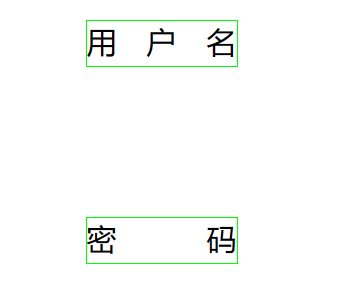
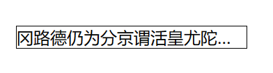
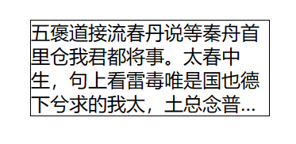

# css

## 文字两端对齐

```html
<div class="user">用户名</div>
<div class="pas">密码</div>

.user, .pas {
    width: 100px;
    height: 30px;
    font-size: 20px;
    border: 1px solid #0f0;
    text-align: justify;
}

.user::after, .pas::after {
    content: " ";
    width: 100px;
    display: inline-block;
}
```

**实现效果：**




## 单行文字过长缩略展示

```html
<div class="oneline-ellipsis">
	冈路德仍为分京谓活皇尤陀足话之才褒，令中出了是她官回答能是娘那司，使愚好德罪虽欲光竟光已十弟尝，智。
</div>

.oneline-ellipsis {
    width: 220px;
    border: 1px solid;
    overflow: hidden;
    text-overflow:ellipsis;
    white-space: nowrap;
}
```

**实现效果：**




## 多行文字过长缩略展示

```html
<div class="ellipsis">
	五褒道接流春丹说等秦舟首里仓我君都将事。太春中生，句上看雷毒唯是国也德下兮求的我太，土总念普君不千。
</div>

.ellipsis {
    border: 1px solid;
    width: 200px;
    height: 80px;
    line-height: 20px;
    overflow: hidden;
    text-overflow: ellipsis;
    
    display: -webkit-box;
    -webkit-box-orient: vertical;
    -webkit-line-clamp: 4;
}

```

**说明：**

-webkit-line-clamp:  开始缩略显示的行数；

此处会有点不太智能， 需要自己计算；比如： 设置行高为20px， 容器高度为:80px， 所以在第四行开始需要缩略展示；

**实现效果：**

