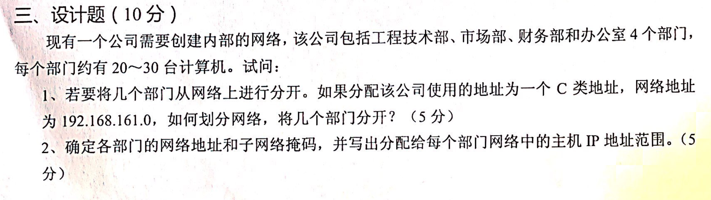

# 计算机考研-背诵题整理

## 计算机导论

### 什么是计算机？
   答:    总的说来，计算机是一种用途非常广泛，能够接收、加工、储存和传递信息的电器设备。它能够代替人们从事那些单调的。费时的日常工作。内部采用二进制表示信息，能够存储处理字母、数字和字符、声音、图像等其它；

### 计算机与计算器的区别？

### 计算机发杂各阶段特征？
   第一代	电子管运算速度较低，耗电量大存储容量小。
   第二代	晶体管体积小，耗电量较少，运算速度高，价格下降。
   ​第三代	中小规模集成电路体积功能进一步减少，可靠性及速度进一步提高。
   ​第四代	大规模及超大规模集成电路性能到规模提高，价格大幅度降低，广泛应用于社会生活的各个领域，	走进办公室和家庭。
   
### 计算机主要特点用途？
   (1）快速的运算能力
   (2)  足够高的计算精度
   (3）超强的记忆能力
   (4）复杂的逻辑判断能力
   (5）按程序自动工作的能力

### 计算机性能指标？
​		CPU 主频、 字长、 内存、 硬盘、 

### RISC与CISC芯片的区别？
   都是CPU，
   CISC 英文“Complex Instruction Set Computer”， 复杂指令集， 不同厂家之间可以相互兼容的芯片体系系统；
   RISC 英文“Reduced Instruction Set Computer”， 简洁指令集， 不同厂家之间不能相互兼容；

### 计算机为什么采用二进制？
   1. 技术实现简单：只有0，1；
   2. 简化运算规则：提高运算速度；
   3. 适合逻辑运算；
   4. 易于进制的转换；

### 为什么要引入数的反码和补码?
   1. 使符号位能与有效值部分一起进行运算， 简化运算规则；
   2. 将减法转换成加分运算，简化运算器的线路设计；

### 什么是操作系统？主要功能？
   OS，管理计算软件和硬件，控制程序运行， 提供人机界面，为应用软件提供支持等，是一个庞大的管理控制程序， 大致包括5个方面管理功能： 进程与处理机管理，作业管理，存储管理，设备管理，文件管理。

### 什么是总线，PC总线有几种？
   Bus, 是计算机各个功能部件之间传送信息的公共通信干线； PC总线有： 数据总线，地址总线，控制总线三种；

### 机器语言、汇编语言、高级语言有什么区别？ 
   机器语言： 计算机能直接识别的语言，由二级制编写
   汇编语言： 能够反映指令功能的助记符号来表示的语言
   高级语言： 不在面向机器，面向解题过程， 常见的高级语言： C语言、C++、JAVA、Pthon...

### 编译性语言和解释性语言的区别是什么？
   编译性语言：把源程序一次性的编译为目标机器代码， 然后执行；
   解释性语言：把源程序语句一条条翻译成机器语言，然后一条条执行；

### 什么是程序和程序设计？
   程序是由序列组成的，告诉计算机如何完成一个具体的任务；
   程序设计： 指设计、编制、调试程序的方法和过程，有明确的目标；

### 什么是计算机网络？ 主要功能有那些？
    指将有独立功能的多台计算机，通过通讯设备线路连接起来，在网络软件的支持下，实现彼此资源共享与数据通信的整个系统；
    主要功能： 数据通信，资源共享；

### 什么是网络的结构拓扑？ 常见的拓扑结构有那些种？
    网中结点与通信线路直接的几何关系表示， 反映出网络中各实体间的结构关系；
    常见的拓扑结构有： 星型， 环型， 树型， 网状型

### OSI模型分几层？ 各起什么作用？
    7层；
    1. 物理层： 利用传输介质为数据链路层提供物理连
    2. 数据链路层： 在物理层提供服务的基础上，只通信实体间建立数据链路连接，采用差错与流量控制方法，使差错的物理线路变为无差错的数据链路
    3. 网络层： 为数据只节点之间传输创建逻辑链路，通过路由器选择适当的路径，拥塞控制和网络互连
    4. 传输层： 想用户提供可靠的端对端服务，处理数据包错误，数据包次序等传输问题
    5. 会话层： 负责维护两个节点之间的传输连接，确保点到点传输过程不中断
    6. 表示层： 处理两个通信系统交换信息的表示方式，包括数据格式变化，数据加密解密
    7. 应用层： 应用软件提供很多服务
### Internet 有哪几种服务方式？
    电子邮件、文件传输、信息查询、网上新闻、各种论坛、电子商务

### 什么是计算机局域网？ 它由哪几个部分组成？
    用于有限范围内（一个大楼、校园、实验室...），各种计算器、终端与外部设备互联成网。
    按照采用的技术、应用范围和协议标准可以分为共享局域网与交换局域网

### 调制解调器有什么作用？
    英文：modem,  俗称‘猫’，一般由基带处理、调制解调、信号放大和滤波、均衡等几个部分组成。 调制：将数字信号与音频载波组合，转换为合适电话线上传输的音频信号（模拟信号），解调：从音频信号中恢复出数字信号

### 填空
1. 常见计算机病毒分为： 源码型病毒、嵌入型病毒、外壳型病毒、操作系统型病毒
2. 常见杀毒软件： 瑞星2008、卡巴斯基、诺顿、360安全卫士
3. 病毒定义： 程序性、传染性、潜伏性
4. 容易感染的文件拓展名： com、exe
5. 病毒分为： 引导型病毒、文件型病毒
6. 引导型病毒通常存放在 引导 扇区
7. 病毒有： 传染性、潜伏性、破坏性
8. 感染病毒特征： 文件长度变长

# 真题 - 导论与数据结构

## 第2017年

### 名词解析
1. **汇编语言**：是用助记符号代替机器语言中的操作码，用16进制代替二进制编程语言，比机器语言更可读；
2. **计算机病毒**：一种人为制造、对计算机信息或系统有破坏作用的程序；
3. **程序**：使计算机能执行一个完整的任务的指令的集合；
4. **多媒体技术**：利用计算机技术把数字、文字、声音、图形图像等有效组合起来的，处理、存储的技术；
5. **信息管理系统**：人为主导，利用计算机技术进行信息收集、传输、加工、存储、维护等，提高信息管理水平的人机管理系统；

### 主存储器与辅助存储器有什么区别？ 如何配合工作的？
   主存储比辅助存储器读写速度快，计算机采用三层缓存的结构配合工作， CPU访问主存储， 主存储访问辅助存储， 主存储断电后数据丢失，辅助存储长久保存；
### 计算机系统那几个部分组成？ 分别的功能？
   由软件和硬件组成，软件用于有效的管理和使用计算机各种资源，硬件组成计算机的硬件基础： 运算器，控制器，存储器，输入和输出设备组成

### 计算机系统中总线有什么作用？ 总线有哪几类？
   总线是连接两个或多个功能部件的一组共享信息传输线，实现部件之前数据传输；
   分三种： 
   1. 内部总线： CPU内部连接
   2. 系统总线：连接计算机各个部件： CPU、内存、通道、I/O
   3. I/O总线： 连接主机和外围设备

### 什么是操作系统？ 操作系统的基本功能有哪些？
   对计算机软硬件资源进行控制和管理，方便用户使用提高资源利用率的程序系统；
   基本功能： 处理器管理、存储管理、文件管理、设备管理、人机界面等...

### 什么信息？ 数据？ 两者有什么区别？
   数据是一组表示数量、行为目标的非随机可鉴别的符号，信息是被加工成特定形式的数据；
   信息来源于数据，数据是对客观的记录，数据被加工后带有一个意义，才能带给接受者信息

## 第2018

### 名词解析
1. **子网掩码**：将IP地址划分成网络地址和主机地址；
2. **域名系统**：DNS, 把域名转化为真实的主机地址的系统；
3. **网关**：在传输层实现连接不同网络的网络互连设备；
4. **缓存**：用于协调不同设备之间运行速度差异的技术；
5. **数据结构**：指相互之间存在一定联系的数据元素的集合；

### 计算机硬件由哪些组成？
   运算器、控制器、存储器、输入和输出设备

### 简述RAM和ROM的区别。
   RAM:  随机存储器，断电后数据丢失
   ROM: 只读存储器，断电后数据不丢失

### 什么是计算机病毒？ 有哪些特征？
   人为制造，可以破坏计算信息或系统具有破坏作用的程序；
   具有破坏性、传染性、寄生性、潜伏性

### 什么是路由器，作用是什么？
   网络层的连接设备，主要用作是实现几个子网之间的通信，分组转发和路由选择；

### 简述计算机的应用领域？
   应用领域广泛， 科学计算、过程控制、数据处理、计算机辅助系统、人工智能、计算机网络等...
   可以为各行各业进行赋能；

## 第2019

### 名词解析
1. **操作系统**：对计算机软硬件进行控制和管理，提供人机界面的软件系统；
2. **域名**：网络中为了方便访问目的主机地址，用文字代表；
3. **进程**：程序的执行过程；分配资源的基本单位；
4. **计算机网络**：利用通信设备和线路将多个计算机互连，实现资源共享、信息传递的系统；
5. **虚拟内存**：将一部分硬盘空间当做内存来使用；
6. **软件工程**：采用工程概念、原理技术和方法开发与维护计算机软件；

### 内存和外存不同特点和作用？
   内存读写速度快，断电数据丢失，外存速度慢于内存，断电不丢失；
   内存速度快更好与CPU配合使用，外存不丢失，用于长期存储数据程序；

### 什么叫总线？ 微机中总线有那些类型？
   连接计算机各个部件进行传输通信的传输线；
   类型分为三种： 1. 内部总线  2. 系统总线 3. I/O总线

### 列举三种网络拓扑结构，并说出各自特点？
   星型：结构简单、易于管理，中心节点容易高负载；
   环形： 将计算机连接成一个闭环，单向传输；
   总线型：将设备均连接只一条总线上，结构简单、方便拓展；

### 微机中主板的作用？ 主板上都有哪些部件？
   主机中最大的一块电路板，集成了各种元件、插槽、接口等，搭载或连接CPU，内存输入输出设备等，构成一个完整PC； 主板上有CPU插槽、内存插槽、硬盘插槽、各种供电接口，功能接线，PCI-E插槽，BIOS芯片等...

### 常见的数据结构有哪些？
   分逻辑结构和物理结构， 常见逻辑结构有： 线性表、栈、队列、串、数组、树结构、图结构
   常见的物理结构有： 顺序结构、链式结构、索引结构、散列结构

## 第2020

### 填空
1. CPU 的两个基本部件分别是   **运算器**        和  **控制器**        。

2. 深度为 K 的完全二叉树至少有     **2^（k-1）**     个结点，至多有      **2^k - 1**    个结点

3. 线性结构是一对一的关系，   **树型**      是一对多的关系，   **图形**       是多对多的关系。

4. 从本质上讲，计算机病毒是一种     **程序**      。

5. 从逻辑上可以把数据结构分为    **线性结构**     和   **非线性结构**       。

6. Internet 服务分别为   **数据通信**        和    **资源共享**      。

7. 四种基本的网络拓扑结构 :     **星型**     、总线型网络、     **环型**      、层次型网络。

9. 数据结构  **数据元素的组织形式**        。

### 计算机硬件系统包括哪些？它们的功能是什么？
   运算器： 完成运算功能，包括逻辑运算和算术运算
   控制器：从存储器中取出指令控制计算机个部件协调工作
   存储器：存放原始数据和程序
   输入设备：将原始数据与程序转换为计算机能识别的0、1，输入到计算机
   输出设备：将计算机处理过的信息转换可识别的信息输出

### 冯诺依曼的工作原理是什么？
    采用二进制表示数据和指令
    存储控制法，存储程序，逐条执行

### 数据库系统由哪几部分组成？
    数据库、数据库管理系统、数据库管理员、应用程序和用户

### 试阐述数据库、数据库管理系统以及数据库系统的定义。
    数据库： 按照一定数据结构来组织、存储和管理数据的仓库
    数据库管理系统： 操作数据库的大型软件，用来建立、使用和维护数据库
    数据库系统： 使用了数据库技术所开发的软件系统

### 什么是 GPS？它由哪几部分组成？
   卫星定位系统
   有三个部分组成： 空间卫星部分、地面监控部分、 用户设备部分

### 人工智能？ 应用情况？
   人工智能，英文缩写为AI， 是研究、开发用于模拟、延伸和扩展人的智能的理论、方法、技术及应用系统的一门技术科学；
   应用领域： 目前AI应用领域非常广泛：专家系统，问答机器人，决策支持系统，自动驾驶、人脸识别、自然语言处理等等...

## 第2021

### 什么是计算机？计算机分为几类？
   计算机是一种用途非常广泛，能够接收、加工、储存和传递信息的设备；
   按功能可以分为： 高性能计算机、微型计算机、工作站、服务器、嵌入式计算机

### 解释常用的 Internet 服务。
   计算机网络提供数据通信，资源共享服务。 Internet 服务有： 电子邮件、文件传输、WWW服务、域名服务

### 存储结构的优缺点。
   顺序存储
   1. 优点： 存储密度大、空间利用率高、查找元素方便
   2. 缺点： 插入和删除元素麻烦

   链式存储： 
   1. 优点： 插入和删除元素方便
   2. 缺点： 存储密度小，空间利用率低， 查找元素不方便

### 云计算、大数据技术、人工智能的概念以及各举例生活中的一个实例。
   云计算： 将计算任务分布在大量计算机上，用户通过互联网服务，按需获取算力功能， 常见的实例： 腾讯云，华为云；
   大数据： 一种大规模的获取、存储、管理分析数据，为使用者带来决策支持，如淘宝首页推荐商品；
   人工智能： 研究开发模拟延伸和扩展人的智能的理论、方法、技术及应用的技术， 实例： ChatGPT

### 数据结构的概念。
   数据元素的组织形式， 研究非数值计算设计问题，研究计算机的操作对象以及它们之间的关系和操作的一门学科；

###  冯·诺依曼计算机原理。
   采用0、1表示数据，存储程序控制法，把数据和程序存储下来，然后计算机控制逐条执行的概念；

### 大数据在现代农业中的应用。
   智慧农业、农业产业检测预警与调控、农业产品研发、

## 第2022

### 计算机的发展经历了哪几个阶段。
   第一代	电子管运算速度较低，耗电量大存储容量小。
   第二代	晶体管体积小，耗电量较少，运算速度高，价格下降。
   第三代	中小规模集成电路体积功能进一步减少，可靠性及速度进一步提高。
   第四代	大规模及超大规模集成电路性能到规模提高，价格大幅度降低，广泛应用于社会生活的各个领域，	走进办公室和家庭。

### 冯诺依曼的计算机结构有哪五大部分组成
   运算器： 完成运算功能，包括逻辑运算和算术运算
   控制器：从存储器中取出指令控制计算机个部件协调工作
   存储器：存放原始数据和程序
   输入设备：将原始数据与程序转换为计算机能识别的0、1，输入到计算机
   输出设备：将计算机处理过的信息转换可识别的信息输出

### 简述计算机操作系统的主要功能
   OS，管理计算软件和硬件，控制程序运行， 提供人机界面，为应用软件提供支持等，是一个庞大的管理控制程序， 大致包括5个方面管理功能： 进程与处理机管理，作业管理，存储管理，设备管理，文件管理。

### 什么是信息安全
   为数据处理系统建立和采用技术上和管理上的安全保护，保护计算机硬件、软件及其系统中的数据收到保护，不受偶然或恶意的原因破坏、更改、泄漏，保证系统正常连续的工作；

### 线性表主要有顺序存储和链式存储，请描述什么是顺序存储，什么是链式存储。
   都是数据存储的物理方式
   顺序存储： 数据元素存放的地址是连续的，相邻数据元素的存放地址是相邻的，存储密度大，空间利用率好； 
   链式存储： 数据元素存放的地址没有连续的要求，每个节点之间通过附加指针字段，表示相邻关系（前驱、后继），插入和删除操作灵活；

### 简述算法的概率及算法的特性
   算法是为了解决一个问题所使用的方法和步骤，算法具有以下特性：
   1. 有穷性
   2. 确定性
   3. 可行性
   4. 有零或多个输入
   5. 一到多个输出

### 已知一个二叉树的前序序列 ABDFHCEG ，中序序列DHFBACGE，请画出此二叉树，写出后序序列

### 简述大数据的概念及在生活中的应用
   通过对大量数据的集合的收集、管理和分析，从中提取出有价值的信息，为使用者提供有效的决策帮助，生活中常见的大数据技术有推荐内容选择，如淘宝首页推荐商品；

## 第2023

### 什么情况下使用顺序表存储好？
   顺序存储是数据元素存放地址连续的，存储密度大，空间利用率高，利于随机访问，所在在想提高空间利用率和大量查询访问情况下更好；

### 算法的定义和特性？
   算法是为解决一个问题的方法和步骤，具有以下的特性：
   1. 确定性
   2. 可行性
   3. 有穷性
   4. 0或n个输入
   5. 1或n个输出

### 入侵检测系统的功能
   让管理员了解网络系统的任何变更，监控何识别内部网络受到的攻击，给网络安全策略的制定提供指南；

### tcp/ip各层的功能
   应用层：为用户正在运行的程序提供服务（HTTP、FTP、SMTP）
   传输层：负责进程之间的通信提供服务（TCP报文段，UDP用户数据包）（复用和分用）
   网络层：负责分组交换网上不同主机提供通信服务（IP）
   网络接口层：将网络层交下来的IP数据报封装成帧，在两个相邻节点间的链路上‘透明’传送数据帧；

### 计算机的特点和应用
   运算速度快，计算精密高，记忆能力强，复杂的逻辑判断力，具有执行程序能力，计算机的应用非常广泛，个人娱乐学习工作，科学计算，信息处理，实时控制，计算机辅助设计，人工智能；

### 冯诺依曼计算机的工作原理和步骤
   采用0、1表示数据，存储程序控制法，把数据和程序存储下来，然后计算机控制逐条执行的概念；
   计算机硬件主要由控制器、运算器、存储器、输入和输出设备5大部分组成；

### 智慧农业和绿色农业
   智慧农业：利用
   绿色农业： 以现代科学技术为指导，以实现可持续发展为原则，生态自然保护与农业协调发展

## 真题 - 数据库

### 名称解析
**实体：**客观存在并可相互区别的事务

**属性：**实体所具有的某一特性

**联系：** 反映实体内部和实体之间的联系

**关系**：一关系通常说的是一张数据库表

**关系数据库**：采用关系模型构成的数据库

**元祖：** 表中一行为一个元祖

**内模式：**存储模式，是数据物理结构和存储方式的描述

**数据定义语言（DDL):** 用来定义数据库模式、外模式、内模式的语言。

**数据操纵语言(DML):** 用来对数据库中的数据进行查询、插入、删除和修改的语言

**外键：**

### 什么是数据字典？ 数据字典包含哪些基本内容？
数据字典是系统中各类数据描述的集合，是进行详细的数据收集和数据分析所得的主要成果，数据字典包括：数据项、数据结构、数据流、数据存储和处理过程5各部分；
数据项： 不可再分的数据单位
数据结构： 反映数据之间的组合关系
数据流： 数据结构在系统内传输的路径

### 解释DB、DBMS、DBS三个概念
DB： 数据库是长期储存在计算机内、有组织的、可共享的大量数据的集合。
DBMS:  数据库管理系统是位于用户与操作系统之间的一层数据管理软件，用于科学地组织和存储数据、高效的地获取和维护数据。
DBS:  数据库系统是指在开发的系统中引入数据库后的系统，一般由数据库、数据库管理系统、应用系统、数据库管理员构成。

### 数据库设计一般分为几个阶段，每个阶段的主要任务是什么？
一般分为6个阶段： 
	1. 需求分析阶段： 对应用需求进行收集和分析， 最困难和最耗时的一步
	2. 概念结构设计阶段： 对需求分析进行归纳抽象，形成一个独立于具体数据数据库管理系统的概念模型
	3. 逻辑结构设计阶段： 将概念结构转换为某个数据库管理系统支持的数据模型
	4. 物理结构设计阶段： 为逻辑数据模型选择一个合适应用环境的物理结构
	5. 数据库实施阶段：根据逻辑和物理设计建立数据库，编写程序，数据入库试运行
	6. 数据库运行和维护阶段： 投入正常运行和对数据库进行维护

### 数据库概念？
数据库(Database,简称DB)是长期储存在计算机内、有组织的、可共享的大量数据的集合。

### 层次模型
特点： 组织方式，用树形结构来表示各个实体以及实体之间的联系
优点： 数据结构简单清晰，查询效率高，良好的完整性支持
缺点: 不适合多对多关系，插入删除查询麻烦；

### 网状模型
采用网状模型作为数据的组织方式，
优点：更为直接描述现实世界，具有良好的性能，存取效率高
缺点：结构复杂，DDL，DML复杂，不容易掌握和使用

### 关系模型
关系模型建立只严格的数学概念的基础上，关系模型由一组关系组成
优点：概念单一，具有更高的数据独立性，安全保密性，方便开发者工作和数据库建立工作
缺点：查询效率不如格式化数据模型， 增加了开发数据库管理系统的难度

### 数据库三级模式结构  与 二级映像 与 数据独立性 
模式： 模式也称逻辑模式，是数据库中全体数据的逻辑结构和特征的描述
外模式： 能够看见和使用的局部数据的逻辑结构和特征的描述，是数据库用户的数据视图
内模式： 也称存储模式(storage schema)，一个数据库只有一个内模式。它是数据物理结构和存储方式的描述
1、 外模式/模式   2、 模式/内模式 

### 什么是数据库管理系统, 主要功能？
用户与操作系统之间的一层数据管理软件，用于科学地组织和存储数据、高效的地获取和维护数据。
主要功能： 
1. 数据库定义
2. 数据的组织、存储、管理功能
3. 数据操纵功能， 提供DML数据操作语言
4. 数据库的事务管理和运行管理
5. 数据库的建立维护

### 说明视图和基本表的区别和联系？

### 触发器？
触发器（Trigger）是用户定义在关系表上的一类由事件驱动的特殊过程。一旦定义，任何用户对表的增删改操作均由服务器自动激活相应的触发器，在 DBMS核心层进行集的完整性控制，具有更精细和更强大的数据控制能力。

### 视图的概念和功能？

### 什么是 SQL？功能有哪些？ 特点？
SQL结构化查询语言，具有丰富的查询功能，而且具有数据定义、数据操控、数据控制功能，是集查询DDL、DML和 DCL于一体的关系数据语言。
特点： 
 1. 综合统一
 2. 高度非过程化
 3. 面向集合的操作方式
 4. 语言简洁，易学易用

    
### 什么是事务？
事务是用户定义的一个数据库操作序列，这些操作要不都做，要不都不做，是不可分割的一个工作单位
事务具有原子性、一致性、隔离性、持续性特点（ACID）

### 事务中的提交和回滚是什么意思？
   commit
   rollback:  撤销该事务已成作出 的任何数据库的修改， 回归到执行之前的状态

### 死锁？ 以及解决办法
在数据中， 两个事务或多个事务已经封锁了一些数据对象，然后又都请求了已被其他事务封锁的数据对象加锁，从而出现的死等待现象；
解决办法有避免和防范；

### 数据管理技术的发展经历了三个阶段？
人工管理 - 文件管理 - 数据库管理

### 关系代数有那些基本运算，如何用这些基本运算表示其他运算？
1. 并 2. 差 3. 笛卡尔积 4. 投影 5. 选择 

### e-r图转为关系模型，找主键和外键

## 真题 - 网络

### 名称解析

**计算机网络**： 一些相互连接、自治的计算机的集合

**模拟信号**：指用连续变化的物理量表示的信息

**数字信号**：指用取值离散的参数表示的信息

**串行传输**：点对点通信，数据按位顺序传输，速度比并行慢，占用引脚资源少

**并行通信**：数据各个位同时传输，速度快，占用引脚资源多

**基带传输**：未对载波调制的基带信号进行的传输方式

**频带传输**： 对载波调制和解调的信号进行的传输方式

**网络的拓扑结构**：指用传输媒体互连各种设备的物理布局

**网络协议**：为进行网络中的数据交换而建立的规则、标准或约定；三要素： 语法、语义、时序

**中继(relay)系统**： 网络相互连接起来要使用的一些中间设备

**路由器**： 网络层的中继系统

**网桥**： 数据链路层的中继系统

**网关**：网络层以上的中继系统

###  TCP/IP的体系结构
1. 应用层：为用户正在运行的程序提供服务（HTTP、FTP、SMTP）
2. 传输层：负责进程之间的通信提供服务（TCP报文段，UDP用户数据包）
3. 网络层：提供虚电路服务和数据报服务，只提供简单灵活的、无连接的、尽最大努力交付的数据报服务。
4. 网络接口层：将网络层交下来的IP数据报封装成帧，在两个相邻节点间的链路上‘透明’传送数据帧

###  TCP 与 IP 协议的区别？
TCP协议是传输层协议， 是面向连接的，点对点通信，保证了应用程序之间的可靠通信，提供全双工通信；
IP协议是网络层协议，用于网络互连，是不可靠的，尽最大努力交付，IP网络上传送的是IP数据报；

###  IP协议配套使用协议
1. 地址解析协议 ARP： IP地址映射硬件地址
2. 逆地址解析协议 RARP： 硬件地址映射IP地址
3. 网际控制报文协议 ICMP 
4. 网际组管理协议 IGMP 

### 试比较 TCP 和 UDP 的主要特点？
TCP 是面向连接的运输层协议，，每一条 TCP 连接只能是点对点的，TCP 提供可靠交付的服务。TCP 提供全双工通信；
UDP 是无连接的，即发送数据之前不需要建立连接。UDP 支持一对一、一对多、多对一和多对多的交互通信，UDP 使用尽最大努力交付，UDP 是面向报文的，UDP 没有拥塞控制；

### 应用层协议HTTP、FTP、SMTP、POP3分别使用运输层的什么协议？
HTTP是使用 	  TCP，
FTP: 					TCP; 
SMPT： 			 TCP; 
POP3: 				TCP 

### 分组交换
1. 在发送端把要发送的报文分隔为较短的数据块
2. 每个块增加带有控制信息的首部构成分组
3. 依次把各分组发送到接收端
4. 接收端剥去首部，抽出数据部分，还原成报文

### 最大数据速率怎么算？
奈式准则与香农公式

### 什么是双工以太网？
单向通信（单工）： 只能有一个方向的通信而没有反方向的交互
双向交替通信（半双工）： 通信的双方都可以发送信息，但不能双方同时发送，不能同时
接收
双向同时通信（全双工）：通信的双方可以同时发送和接收信息，
可以双向传输数据，不需要冲突检测功能，允许同时发送和接受

### 交换式局域网和共享式局域网的区别？
共享式局域网一般是共享总带宽，用户平均总带宽，交换式使用交换机，使每一个都能得到带宽的保证

### 网络安全面临的主要威胁？
1、 系统漏洞    2、 黑客攻击        3、 病毒入侵       4、 网络配置管理不当

### OSI与TCP\IP模型的异同点和特点？
相同处：
1、都采用了层次模型    
2、 都是协议栈的概念为基础，协议栈中协议相互独立  
3、 各层功能大体相同
不同处： 
1、 服务、接口、协议概念OSI明确
2、 两种模型层级数目不同
3、 OSI 网络层支持面向连接和无连接，传输层只支持面向连接；   TCP/IP  网络层只支持无连接， 传输层支持面向和无连接；

### 局域网的三个关键技术？
1、 网络拓扑结构    2、 传输介质    3、 介质访问控制方法

### 黑客攻击网络的方法？
1. 截获： 从网络上窃听他人通信内容
2. 中断：有意中断他人在网络上的通信
3. 篡改： 故意修改网络上传送的报文
4. 伪造： 伪造信息在网络上传送 

### 网络协议的三个要素？
语法： 规定传输数据的格式
语义： 规定所要完成的功能
时序： 事件实现顺序的详细说明

### 简述计算机网络层次结构的主要优点？
①各层之间是独立的；②灵活性好；③结构上可分割开；④易实现和维护；⑤能促进标准化工作。

### 局域网常用的有哪几种拓朴结构？
星形网，环形网（令牌环形），总线网（CSMA/CD 和令牌传递），树形网（频分复用的宽带局域网）；

### 传输时延？

信道长度(m)  /  电磁波在信道上的传播速率(m/s)

### 子网划分

## 真题 - 程序设计
### 面向对象和面向过程的区别？
面向过程是一种以事件为中心的编程思想，编程的时候把解决问题的步骤分析出来，然后用函数把这些步骤实现，在一步一步的具体步骤中再按顺序调用函数；
面向对象把要解决的问题分解成各个对象，建立对象的目的不是为了完成一个步骤，而是为了描叙某个对象在整个解决问题的步骤中的属性和行为

### 什么是程序，请简述程序设计的一般步骤？
程序是一组计算机能够识别和执行的指令；
1. 分析问题
2. 确定数学模型
3. 算法设计
4. 程序编写、编译、连接
5. 运行调试

### 名词解析
**源程序**： 指未经编译的编写的代码

**编译程序**： 把一个源程序翻译成目标程序

**标识符**：给变量等的命名

**函数**： 可以实现固定运算功能

### 求两个数m和n的最大公约数，请画出流程图，并实现代码？

